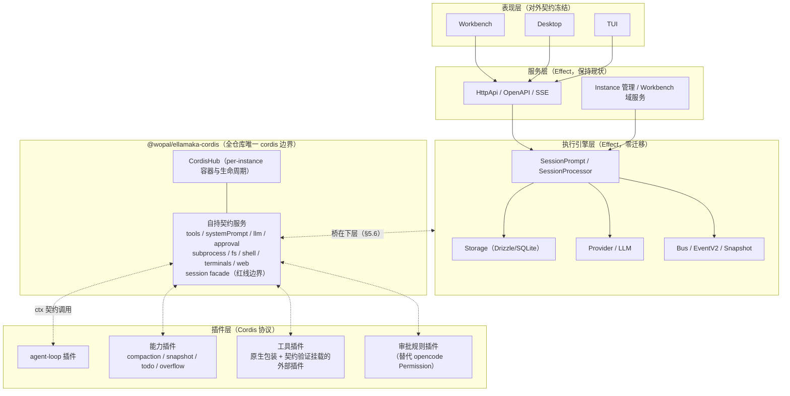
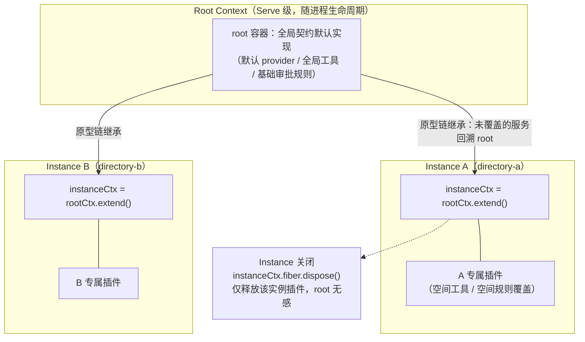
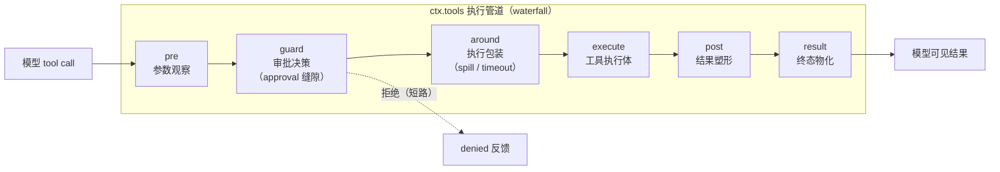
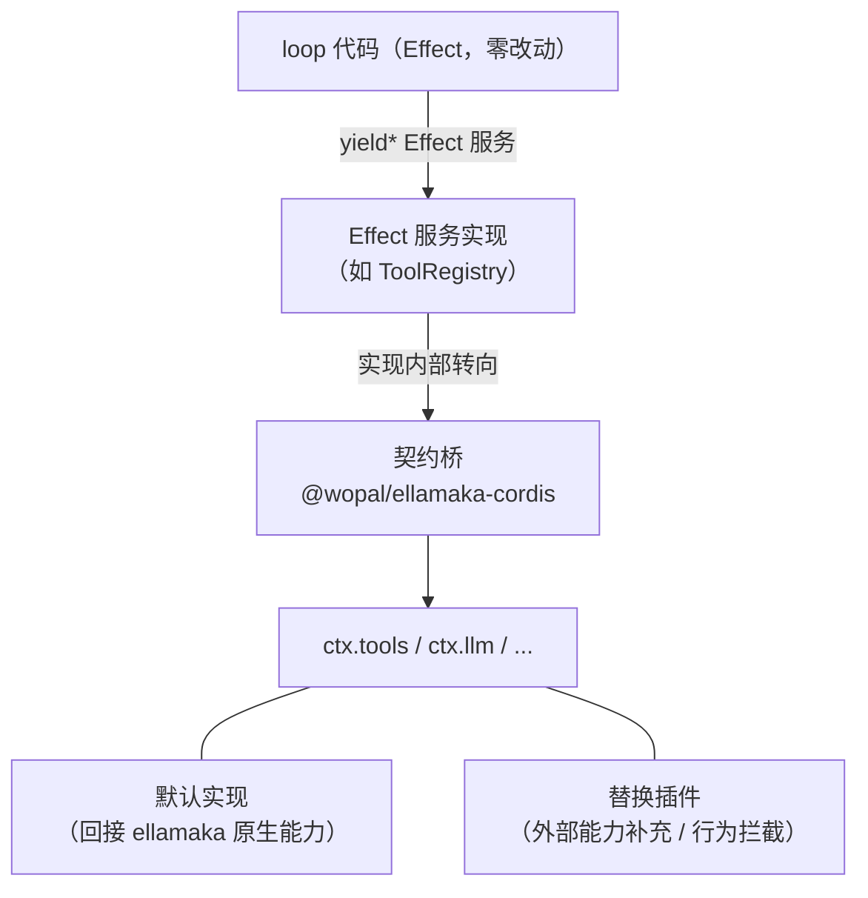
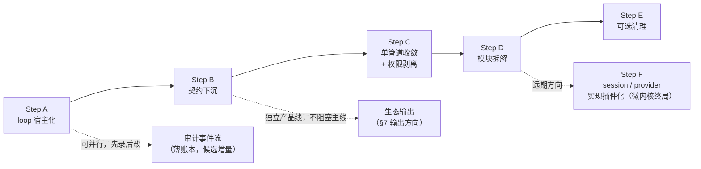

# DESIGN-refactor-cordis — Cordis 运行时改造设计

> **状态**: Draft（设计定稿，实施未启动）
> **更新时间**: 2026-08-16
> **上级架构**: `DESIGN.md`
> **研究依据**: `research/deepseek-harness-architecture-and-integration-research.md`

## 1. Role

本文档是 ellamaka 向 Cordis 插件化运行时演进的架构真相源。它定义终态蓝图、自持契约规范、迁移路径与红线边界。

本设计源于对 DeepSeek Harness (dsh) 与 Cordis 的系统性审计（464 包依赖分析 + Bun 运行时实测），审计结论与证据见研究文档。研究文档中的原方案（换心手术 + 4 大网桥 + 挂载 dsh 插件生态）已被本文档取代。

### 1.1 终态一句话

ellamaka 演进为 Cordis 微内核架构：agent loop 及其拆解模块、全部工具、权限审批，直至 session 存储与 provider 的实现，最终均为 Cordis 协议插件；执行引擎（Effect）与 session 数据契约（持久化格式、事件定义、对外 API）保持现状。这套插件化能力组合既服务 ellamaka 自身演进，也向 dsh 插件生态双向输出（§7）。

### 1.2 硬约束

三条约束贯穿全部设计决策，任何阶段不妥协：

1. **session 数据契约零变更** — 存储格式、事件定义、对外 API 冻结。session 在 Cordis 层只有 facade（§5.7）。session 实现**组合形态**的插件化（Step F）以数据契约不变为前提。
2. **loop 渐进插件化** — 复用 opencode loop 的能力成熟度（流式、工具并发、compaction、snapshot、重试），逐步改造为标准 Cordis 插件，逐步拆解模块。任何阶段不重写 loop 内核。
3. **权限体系替换** — opencode Permission 退役，审批决策收敛到 Cordis approval 缝隙（与单管道收敛是同一工程，§6 Step C）。

### 1.3 分工原则

Cordis 拥有**组合权**：生命周期、插件装卸、事件分发、扩展点。Effect 拥有**执行权**：结构化并发、流、类型、存储事务。两个运行时通过 `@wopal/ellamaka-cordis` 包内的桥接服务互通，该包是全仓库唯一允许 import cordis 的位置。

### 1.4 双重愿景

**自用——微内核化**：ellamaka 自身从"Effect 单体 + fork 定制"演进为"Cordis 微内核 + 全插件能力组合"（No Privileged Core）。core 不再是特权代码，而是若干个可替换的基础插件。

**反哺——生态输出**：opencode 打磨成熟的能力（多 provider 模型接入、loop、工具集）封装为标准 Cordis 插件，反哺 dsh 插件生态体系。输入方向（消费 dsh 梯队 1 插件）与输出方向（输出 ellamaka 能力插件）的契约策略独立运作，详见 §7。

## 2. 证据基础（审计结论摘要）

完整证据见研究文档 §11 与本轮审计记录。影响设计的关键事实：

1. **Cordis 在 Bun 下完整可用**（实测：服务注册、inject 依赖、事件系统、`ctx.fiber.dispose()` 生命周期全链路，init 1.79ms）。
2. **dsh 插件生态对 session 模型的依赖分三个梯队**：
   - 梯队 1（约 40 个工具/机制/交互插件）：零 session 依赖，最多只读 `session.header`（id/cwd）；
   - 梯队 2（仅 tool-todo）：需要 `session.append()` 单方法；
   - 梯队 3（session-query/subagent/schedule/compaction/agent-loop）：深耦合 dsh session event log。
   - 梯队 3 的全部能力 ellamaka 已自持且成熟，集成归属为永不引入（§5.7、§9）。
3. **dsh 的服务契约面窄且清晰**：`LlmAdapter` 单方法（stream）、`ToolDefinition`（execute/finalizeContent/timeoutMs）、`systemPrompt.section`、approval waterfall——每个都是几十行的 interface，具备自持复制条件。
4. **ellamaka 已具备桥接挂点**：Plugin Hooks（`tool.execute.before/after`、`chat.params`、`experimental.chat.system.transform`、`permission.ask`、`event`）覆盖了 dsh 以 waterfall 暴露的同类扩展点；EventV2Bridge 表明事件体系本就在向 typed events 演进。
5. **Effect ↔ async 边界行为已实测**（2026-08-16 spike，等版本 Effect 复现）：Effect fiber 调度在 AsyncLocalStorage 传播链上——effect 体内经 async 桥再进入嵌套 runtime 的子 effect，ALS 上下文经 `runFork`/`runPromise`/`setTimeout` 回调三种边界均不丢失；`runFork` + `forkIn(scope)` 的 fiber 被 interrupt 后 finalizer 确定性执行（子先父后）、子任务级联清理、无悬挂。

## 3. 终态蓝图



各层职责：

- **表现层与服务层** 保持 ellamaka 现状，消费现有 SSE 与 OpenAPI。
- **执行引擎层** 继续以 Effect 运行 loop 机制、存储事务与模型通信。它对插件层的存在无感知。
- **桥接层**（`@wopal/ellamaka-cordis`）拥有 Cordis 容器宿主、自持契约的桥接实现、session facade。全部 cordis import 收敛于此。
- **插件层** 由 Cordis 协议插件组成。loop 插件是其中的第一个居民，随后是其拆解模块与外部插件。

### 3.1 多实例映射

每个 Instance 拥有一个 CordisHub，随实例层组装与释放。root context 与 instance context 的原型链派生（`extend()`/`isolate()`）在 Step B 落地，与 InstanceState 的 ScopedCache 生命周期对齐：



## 4. 设计决策记录

| # | 决策 | 内容 | 理由 |
|---|------|------|------|
| D0 | loop 演进方式 | ellamaka loop 自身渐进插件化（Step A→E）；dsh 的 agent-loop/session/session-query/compaction/subagent/schedule 包永不引入 | 复用存量成熟度；session 体系零变更约束；审计确认深耦合包不可分离 |
| D1 | session 边界 | session facade 仅提供 `header(id/cwd)` 与 `append→EventV2` 转发；持久化与事件定义归 ellamaka Storage/Bus 所有 | 防止 event-log SSOT 传导迁移 |
| D2 | 权限替换 | opencode Permission 退役；审批决策收敛到 ctx.tools guard 段的 approval 缝隙 | dsh approval 模型（决策缝隙+可插拔规则+审计入日志）优于内嵌规则引擎；与单管道是同一工程 |
| Q1 | 工具管道 | **姿势 B：ctx.tools 为唯一执行管道**；原生工具逐个包装注册为 ToolDefinition | 双管道长存会使插件拦截对原生工具失效，永久削弱协议价值 |
| Q2 | 契约漂移 | **锁死自持形状**：契约在 `@wopal/ellamaka-cordis` 内自定义（形状借鉴 dsh），不 import dsh 契约包，不跟随 rc 演进；dsh 发正式版后一次性评估 | rc 期无兼容承诺；契约面窄（核心 4 interface）自持成本可控 |
| Q3 | 挂载策略 | 仅为通过契约符合性冒烟测试的插件开放挂载；可挂载清单滚动维护 | 每插件一个冒烟测试（小时级），清单是验证结果而非承诺 |
| D3 | 生态输出 | 输出插件为独立包（`@wopal/dsh-*`），自包含、允许依赖 dsh 契约包并跟随 rc 演进；不进入 ellamaka 主线依赖树 | 反哺通道与主线解耦，dsh rc 波动风险由独立包独立承担 |
| D4 | 配置体系 | settings.json 为唯一配置入口与真相源；Cordis 插件与旧式插件同字段声明、自动识别路由；cordis.yml 不引入 | 用户配置习惯零变更；声明语法与 `ConfigPlugin.Spec` 天然同构，融合成本低；schema 校验采用 schemastery 兼容（与 Q2 契约自持配套，dsh 生态插件免改造挂载） |

## 5. 自持契约规范

### 5.0 总则

契约定义在 `@wopal/ellamaka-cordis` 包内，形状借鉴 dsh 已验证的设计，类型自持、版本自持。契约变更走本包的语义化版本与测试门禁。外部插件（含 dsh 梯队 1 插件）按契约符合性验证挂载（Q3）。

### 5.1 ctx.tools — 唯一工具执行管道

所有权：工具注册、schema 汇聚、执行管道、并发调度归本服务所有。

```typescript
interface ToolDefinition {
  // 模型可见 schema（name/description/parameters，JSON Schema）
  readonly name: string
  readonly description: string
  readonly parameters: JsonSchemaNode
  // 输出声明
  readonly output: ToolOutputDefinition
  // 执行体：接收冻结参数与执行上下文（取消信号、session facade、scope key）
  execute(args: unknown, exec: ToolRunContext): Promise<unknown>
  // 同步末段内容变换（模型可见内容的最后加工）
  finalizeContent?(exec, result): ContentBlock[] | undefined
  // 协作式超时预算（由管道 wrapper 强制，不进模型视野）
  timeoutMs?: number
}
```

执行管道五段：`pre`（参数观察）→ `guard`（审批/拒绝决策，approval 缝隙挂载点）→ `around`（执行替换/包装，spill/timeout 挂载点）→ `post`（结果塑形）→ `result`（终态物化）。全部以 Cordis waterfall 事件暴露，插件可短路（guard 拒绝）或替换（around）。



原生工具迁移：每个 ellamaka 原生工具包装为一个 ToolDefinition 注册（execute 转调现有实现），permission 检查从原生管道移入 guard 段。收敛完成前新旧管道并存（R7 过渡态），收敛后 ctx.tools 为唯一管道，loop 经它调用一切工具。

**已知问题（Plan 1 实证，2026-08-17）**：native grep 上游截断（`grep.ts` 匹配数 >100 只格式化前 100 行）与 dsh spill 的「全量转储」语义不匹配。匹配数爆炸场景下，spill 文件存的是 native 截断后的结果，模型无法从 spill 精确读回剩余匹配，只能重新 grep——spill 的「全量读回」价值仅在「匹配少但行超长」场景成立。修复方向：Step C 单管道收敛时，将工具截断策略统一进 ctx.tools 管道（spill 见全量，截断决策与转储决策同层），而非让原生工具在管道外先行截断。

### 5.2 ctx.systemPrompt — 提示词分段组装

> **终审标注（2026-08-19）**：无消费方，暂不桥接。ellamaka 已有 `experimental.chat.system.transform` 原生钩子承载 system prompt 注入需求（零开发可用）。待真实消费方出现再评估。

所有权：system prompt 的分段注册与排序归本服务所有。插件以 `section({ name, order, text })` 注册段落（人设置顶、工具指南 100-199 段位、动态信息置底），以 `tools(scope)` 注册工具 schema 汇聚回调。桥接实现将段落合成注入 ellamaka SystemPrompt 组装路径（挂点：`experimental.chat.system.transform` 同层）。

### 5.3 ctx.llm — 模型适配契约

> **终审标注（2026-08-19）**：无消费方，暂不桥接。原设计"loop 插件化后经本契约消费模型"的前提（loop 进容器）已被 Step A"桥在下层"路线取代，该用途消失；dsh 生态当前无梯队 1 的 llm 插件。待真实消费方出现再评估。

所有权：adapter 注册与流式调用分发归本服务所有。

```typescript
abstract class LlmAdapter {
  // 唯一必需方法：流式生成
  abstract stream(options: GenerateOptions): AsyncIterable<StreamChunk>
}
```

桥接实现 `EllamakaProviderAdapter extends LlmAdapter`，内部调 ellamaka Provider.Service，Effect Stream 转 AsyncIterable。`llm/stream` waterfall 允许插件拦截/重试/路由模型调用。loop 插件化后经本契约消费模型能力（Step B 桥接，Step C 起 loop 直连）。

### 5.4 ctx.approval — 审批缝隙

所有权：审批请求的分发、会话级 policy（ask/never）、审计事件归本服务所有。`approval/request` waterfall 分发决策；规则提供者（替代 opencode Permission 规则引擎的allow/deny 语义）作为普通插件注册。审计事件经 session facade 的 append 通道入 ellamaka EventV2，前端审批交互复用现有 permission SSE 流（挂点：`permission.ask` 同层）。

### 5.5 能力缝隙 — subprocess / fs / shell / terminals / web

所有权：进程、文件、Shell、PTY、网络等系统能力的抽象缝隙归这组服务所有。桥接实现分别转调 ChildProcessSpawner、AppFileSystem、现有 PTY 服务、HTTP 客户端。工具插件只依赖缝隙契约，切换实现（本地/沙箱/云）对插件透明。

### 5.6 桥在下层 — loop 无感知替换机制

loop 代码继续 yield Effect 服务。Effect 服务的实现内部经桥调用 ctx 契约服务（如 ToolRegistry 实现内调 ctx.tools）。插件对能力的替换发生在桥层，loop 与 session 对替换无感知。这是"拆解模块 + 插件补充能力"目标的实现机制。



#### 5.6.1 桥接 API 规范（Effect↔async 调用形态，实测固化）

全部从 async 侧（Cordis 服务）调回 Effect 世界的桥接遵守以下形态，依据 2026-08-16 spike 实测：

1. **持有 work Fiber 必须 `Effect.forkIn(scope)(work)`**（POC 1.2 实测修正）：在 `Effect.scoped` 内取 scope，`Effect.forkIn(scope)(work)` 直接返回持有的 work fiber，`Fiber.await` 拿到真实 exit。禁止 `ManagedRuntime.runFork(work).pipe(Effect.forkIn(scope))`——该写法双重 fork（外层 runFork 的值是内层 fiber 句柄而非 work 结果，返回值与中断语义错乱）。中断经 `runtime.runFork(Fiber.interrupt(fiber))` 执行（经 hub runtime 启动、不拥有中断权）。禁止 `runPromise` 驱动长任务：其返回裸 Promise 无中断句柄，未受管的 `forever` 类任务导致进程退出时报 `All fibers interrupted without error`。
2. **顶层 `Effect.runFork/runPromise/runCallback` 在运行时未导出**（仅类型声明存在）——一律经 `ManagedRuntime` 实例方法调用，直接调用运行时报 `not a function`。
3. **`Effect.scope` 须在 `Effect.scoped` 内获取**，否则以空 defect Die。桥接 scope 由宿主层的 `Effect.scoped` 提供，finalizer 中对 fiber 执行 interrupt 并等待退出。
4. **ALS 上下文**：effect 体内发起的桥接调用（HTTP handler → 桥 → Cordis 服务 → runFork）沿传播链天然继承 Instance ALS，无需 `Instance.bind`。纯 async 侧发起的轮次（如未来 schedule 插件定时唤醒）不在此列，发起前须捕获-恢复 ALS。
5. **取消语义**：interrupt 后 finalizer 按子先父后顺序确定性执行，`forkIn(scope)` 的并发子任务级联清理，进程 `beforeExit` 干净——取消路径保持 Effect 原生（SessionRunState 独立路由），Cordis 入口只启动不拥有中断权；Cordis 侧发起中断的唯一通道是 `runtime.runFork(Fiber.interrupt(fiber))`（POC 1.2 实测）。

### 5.7 session facade — 红线边界

```typescript
interface SessionFacade {
  readonly header: { readonly id: string; readonly cwd: string }
  // 唯一写通道：转发 ellamaka EventV2，由 Bus 发布
  append(eventType: string, data: unknown): Promise<void>
}
```

session 持久化、事件定义、派生查询、回放归 ellamaka Storage/Bus/EventV2 所有。facade 不实现 event log、不提供派生视图、不承载 SSOT（唯一真相源）。工具插件经 `exec.agent?.session` 访问 facade（header 级只读为主）。

### 5.8 配置装配（ConfigBridge）— 配置体系融合

**唯一配置入口**：settings.json（全局 `~/.wopal/config` + 空间 `.wopal/config/settings.json`）是全部配置的唯一手写来源。Cordis 的 cordis.yml / patch.yml 不进入 ellamaka——配置树是运行时由 ConfigBridge 从 settings.json 物化的投影，不是配置语言。用户配置习惯与现有文档零变更。

**声明融合**：Cordis 插件与旧式插件在同一个 `plugin` 字段声明（`"name"` 或 `["name", { options }]`，与现有 `ConfigPlugin.Spec` 同构）。按包导出形态自动识别路由：声明的是 Cordis 插件协议实现则走容器装配，否则走现有 plugin 加载。识别失败立即报错并指明声明的解析结果（misconfiguration fails loud）。`plugin_origins` 溯源与 dedupe 机制对 Cordis 插件原样适用。

**装配执行**（ConfigBridge 为 `@wopal/ellamaka-cordis` 的第六个契约服务）：

```
settings.json 多层级合并结果
  → 解析 plugin 字段
  → 按 origins 分流：
      global 声明 → root context 装配（随 Serve 生命周期）
      space 声明  → instance context 装配（随实例生命周期）
  → ctx.plugin(name, options)
  → 插件自带的 schemastery Config schema 校验 options 并填补默认值
```

**配置层级与容器层级映射**：

| ellamaka 配置层级 | Cordis 侧装配位置 |
|------------------|------------------|
| global（`~/.wopal/config`） | root context |
| space（`.wopal/config/settings.json`） | instance context（Step B 两级派生） |
| agent frontmatter（tools allow/deny、model） | scope restrict / intercept |
| 命令行/环境变量 | 装配前最后注入 |

**覆盖语义**（cordis.patch.yml 热补丁的等价物）：空间级同名插件声明覆盖全局（origins dedupe 已有）；声明同名 Cordis 插件即替换该服务实现——这是"插件补充能力"在配置面的表达；`settings.json` 可选 `cordis.intercept` 段透传为 `ctx.intercept(name, config)`（高级场景）。

**配套能力**：`--dump-cordis-config` 导出物化后的容器装配树（已装插件、最终配置、层级来源），调试体验对齐 dsh `--dump-config`；热重载（settings watch → 增量重装配）为远期增量能力，非首期承诺，依赖 Cordis fiber 级卸载的原生支持。

**退役线**：Step C 工具统一走 ctx.tools 后，旧式 plugin hooks 体系（`chat.params`/`tool.execute.*` 等）逐步退役，`plugin` 字段最终收敛为纯 Cordis 插件声明——配置融合是该退役线的载体。

### 5.9 能力缝隙：ctx.wopal — wopal-cli 集成

**缝隙定位**：`ctx.wopal` 定义空间访问能力的进程内统一接口（SpaceEntry/ProjectEntry/DirectoryEntry 及查询方法），类型**直接复用 `@wopal/cli-capability-schema`**——缝隙接口是该 schema 的消费视角，不构成第二套契约。CLI 子进程边界与 envelope 协议（`wopal.capability/v1`）原样保留：缝隙解决进程内多消费方共用与实现可替换，envelope 解决 ellamaka 与 wopal-cli 两个独立发布物的版本协作，两者正交。

```
wopal-plugin(Cordis 插件)   Workbench API(对外不变)   桌面端/未来 TUI
        ↘                        ↓                     ↙
                     ctx.wopal（缝隙接口，类型源自 schema 包）
                                ↓
                provider（可替换）：
                ├─ 本地 CLI provider（包装现有 cli-adapter，默认）
                ├─ 远程空间 provider（未来，桌面端连云端空间）
                └─ 只读快路径 provider（未来，直读 STRUCTURE.md）
                                ↓
                    wopal-cli（envelope 协议保留）
```

**收益**：wopal_task_* 工具经缝隙转正（解构式集成退役，即 Step C 的契约化重造）；agent 工具/Workbench/桌面端三方共用一份缓存与实现；换 provider 不动任何消费方；测试可挂假 provider 隔离子进程。

**成本**：约 200-400 行 provider 包装（一次性）；调用链多一跳（进程内，纳秒级）；`cli-capability-schema` 依赖从 opencode 公开依赖收窄为 provider 模块内部依赖（波及面缩到一个模块，依赖本身不消除）。

**版本职责划分**：缝隙接口版本归 `@wopal/ellamaka-cordis` 契约管理（Q2）；envelope/CLI 版本归 wopal-cli 的 capability 协商管理（现有 cli-contract 机制不变）。schema 包的锁步问题靠契约纪律解决（v1 只加字段不删不改，breaking 升版本），与缝隙无关。

**agent 工具面**：wopal 工具插件将 CLI 能力（space list、project scan、skill install 等）包装为结构化工具走 ctx.tools 管道（获得参数校验、guard 审批、审计）；该插件是自研的第一个正式 Cordis 插件，亦是生态输出（§7.2）的首个候选。

**对外契约冻结**：`/wopal-space/spaces`、`/global/health`、`/global/cli/repair` 等 HTTP API 零变更，仅内部实现路径切至缝隙。

**落点**：Step B 缝隙与 CLI provider 落地；Step C/D wopal-plugin 改造为标准 Cordis 插件、wopal_task_* 经缝隙转正。

### 5.10 日志桥接 — cordis 插件日志独立文件

**问题**：cordis 容器加载大量 dsh 插件（spill 三件套、grep 桥、未来的 llm/subprocess/fs 桥等），这些插件内部用 cordis `ctx.logger` 输出日志。ellamaka 主日志已严重洪水，dsh 插件日志混入会进一步恶化可读性。需要将 cordis 插件日志分离到独立文件。

**机制发现**：cordis 4.0.1 自带完整日志子系统（`LoggerService`，Context 四大内建服务之一），具备三项关键能力：
1. **自动命名**：插件的 `ctx.logger` 调用自动以 fiber 名称（插件声明的 `static name`）作为 logger name——dsh 50+ 个插件全部依赖此机制，零手动 Logger 创建。
2. **Exporter 广播**：`ctx.logger.exporter(sink)` 注册一个导出器，即可收到容器内所有插件的日志（全局广播），且跟随 fiber 生命周期自动清理。
3. **per-name 级别控制**：Exporter 的 `levels` 字段按 logger name（即插件名）设级别阈值。这是**插件级**级别控制——同一插件内部不同模块不能不同级别（name 是插件名，不是模块名）。

详细源码分析见研究报告 §14。

**双轨日志设计**：

```
dsh 插件（spill/grep-bridge/...）        自研插件（wopal-plugin 等）
─────────────────────────────           ─────────────────────────
ctx.logger.warn(...)                     rulesLogger.warn(...)
     │                                        │
     ▼                                        ▼
  Exporter（装配层注册）                    自己的 logger.ts
     │                                        │
     ▼                                        ▼
  cordis-plugins.log                      wopal-plugin.log
  （与主 log 同目录）                      （WOPAL_PLUGIN_LOG_*）
```

- **dsh 插件**：必须用 `ctx.logger`（不能改其源码），日志经 Exporter 收集。
- **自研插件**：推荐用 `ctx.logger`（与 dsh 一致）；如需独立日志文件/级别/模块过滤，保留自管理 logger（wopal-plugin 的 `logger.ts` 是范例：独立文件、trace~fatal 六级、模块白名单、敏感字段脱敏）。自管理 logger 是模块级单例、独立于 cordis fiber、用 `appendFileSync` 写文件，转 cordis 插件后零改动继续工作。

**Exporter 设计**：在 `cordis-mount.ts` 装配层为每个 CordisHub 注册一个 Exporter，自管理写入独立文件 `cordis-plugins.log`，不进 ellamaka 主日志。

```
cordis ctx.logger（per-plugin 自动命名）
        │
        ▼
   Exporter（装配层，onHubCreate 注册）
        │
        ├─ 日志路径：按实例目录决定（resolveWopalSpaceRoot(directory)）
        ├─ 日志级别：从 ellamaka 主程序接收（Log.currentLevel()）
        └─ 文件写入：appendFileSync，自管理（不经 ellamaka Log 体系）
        │
        ▼
   cordis-plugins.log（空间/非空间各一个文件）
   ├─ wopalspace 实例 → <space>/.wopal-space/logs/cordis-plugins.log
   └─ 非空间实例     → $WOPAL_HOME/logs/cordis-plugins.log
```

**日志路径与级别来源**：Exporter 不自己读环境变量。路径按实例目录决定——`onHubCreate(hub, directory)` 时用 `resolveWopalSpaceRoot(directory)` 判断：空间内实例写空间规范日志目录（`<space>/.wopal-space/logs/`），非空间实例写 `Global.Path.log`（`$WOPAL_HOME/logs/`）。路径决策不依赖进程级 `Log.file()` 状态（`--print-logs` 模式下主 log 不存在、`Log.file()` 为空串，曾导致日志落到进程 cwd）。级别取 `Log.currentLevel()`（ellamaka 当前进程级阈值，由 `--log-level` CLI 参数经 `Log.init({level})` 设置）。后续 Plan 2 的 ConfigBridge 落地后，级别可经配置文件覆盖（plugin 字段声明）。

**日志格式**：Exporter 复用 cordis 的 `Logger.format(exporter, message)` 格式化，行格式：

```
2026-08-17 14:25:30 [WARN] [spill-policy] keeping raw content (below threshold)
```

`[spill-policy]` 是 cordis message 自带的插件名（自动命名）。与 wopal-plugin logger.ts 的格式风格对齐（timestamp + level + module + message）。

**Exporter 级别过滤**：Exporter 的 `levels` 字段设为 `{ default: LoggerLevel.DEBUG }`（放行所有级别到 Exporter），最终级别过滤由 Exporter 自己按 `Log.currentLevel()` 裁决——同 wopal-plugin logger.ts 的 `shouldLog` 模式。cordis 侧放行、Exporter 裁决，双层避免 cordis 默认 INFO 提前挡掉 debug。

**CordisHub 自身日志**：hub.ts 的 `console.log` 改为 `this.ctx.logger.info('created')` / `this.ctx.logger.info('disposing')`，cordis Logger 自动以 hub 的 fiber 名称为前缀。Exporter 注册在 hub 创建之后、第一个插件挂载之前，确保 hub 自身和所有后续插件的日志都能输出。

**Exporter 生命周期**：通过 `ctx.logger.exporter()` 注册的 Exporter 用 `ctx.effect()` 绑定 fiber 生命周期，hub dispose 时自动移除——零手动清理。

**ellamaka Log 改动**：`core/src/util/log.ts` 需新增 `currentLevel()` 导出（返回模块私有 `level` 变量），供装配层获取当前进程级日志阈值。改动仅一行。

**后续演进**：Plan 2 的 ConfigBridge（§5.8）落地后，cordis 插件日志级别可经配置文件声明（plugin 字段），覆盖主程序传入的默认级别。Plan 2 之前，级别跟随 ellamaka 主程序 `--log-level`。

## 6. 迁移路径

> **⚠️ 本节 Plan 批次叙事已被 §12 路线终审（2026-08-19）修正**：Step B 剩余契约桥、Step C 五段管道叙事撤销，Step D 载体改为 Effect 能力包。当前有效实施序列见 `DESIGN-capabilities.md` 与 `PLAN-TODOS.md`。本节保留为设计推演历史。

五个 Step，每个独立有价值、可停、可回滚（删除桥接包即恢复直连）。Step 顺序即依赖顺序。Step F 为远期方向，排期在 Step D 完成后另定。

**实施拆分**：Step 与实施批次（Plan）的映射见 `PLAN-TODOS.md`（终审后承载全部能力路线）——Step A 全量与 Step B 核心切片（ctx.tools 最小版 + spill 挂载）合并为首个 POC 批次；Step B 剩余为第二批次；Step C 按 C0–C3 拆为两个批次；研究报告 §11 的 A 类机制复刻（不依赖 Cordis 化）为可并行批次。



### Step A — loop 宿主化（第一个 POC）

- **目标**：loop 以 Cordis 插件形态宿主于容器；真实对话轮次经容器驱动执行。
- **范围**：新建 `@wopal/ellamaka-cordis` 包（CordisHub、agent-loop 插件、Effect Layer）；SessionPrompt 以 Layer 包装方式改道（上游文件零改动）；真实轮次、取消、流式全链路验证。
- **验收**：容器随实例层初始化（<10ms）；真实对话经 `ctx.agentLoop` 驱动，SQLite/Snapshot/流式零回归；轮次中 cancel 确定性到达（含后台任务清理）；实例关闭容器 dispose 干净。
- **风险基线**：R2（ALS 上下文）与 R3（取消传播）已由 2026-08-16 spike 在机制层消除（§5.6.1）；本 Step 在真实工程中以集成测试复验，并按 §5.6.1 规范实现桥（ManagedRuntime.runFork + scope）。

### Step B — 能力下沉为契约

- **目标**：§5 契约服务逐个落地为桥接实现（llm → systemPrompt → subprocess/fs → tools 注册表先行，管道在 C）。
- **范围**：每个契约一个桥接服务 + 契约符合性测试；root/instance 两级 context 派生落地；ConfigBridge 首版（plugin 字段声明解析 + global/space 两级装配 + schemastery 校验）；ctx.wopal 缝隙与 CLI provider（包装现有 cli-adapter，Workbench 内部路径切换，对外 API 不变）；首个 dsh 梯队 1 插件挂载验证（建议 spill 三件套，契约面最窄）。
- **验收**：挂载插件在真实对话中生效且可干净卸载；`--dump-cordis-config` 输出装配树；Workbench 空间查询回归全绿；契约测试进入 CI。

### Step C — 单管道收敛 + 权限剥离（核心工程，选型驱动）

- **目标**：ctx.tools 五段管道成为唯一工具执行管道；permission 决策移入 guard 段；opencode Permission 退役删除。
- **执行结构**（选型驱动，四段）：
  - **C0 工具选型决议**：逐槽位评估（输入：研究报告 §12 初评 + 深评），决议每个工具槽位走"包装保留 / 采用 dsh / 废弃 / 新增"；`wopal_task_*` 契约化转正（经 ctx.wopal）归入本段。
  - **C1 缝隙桥加固**：按 C0 选出的 dsh 工具所需缝隙（subprocess/fs/schemastery 校验体系）重点验证。
  - **C2 按决议迁移**：包装侧（保留槽位逐个包装注册）与采用侧（dsh 插件锁版本挂载）并行；过渡双管道在本段收敛为单管道。
  - **C3 权限剥离**：guard 段 approval 规则插件（迁移现有 allow/deny 语义与配置）；opencode Permission 退役删除。
- **验收**：模型可见工具全部来自 ctx.tools；spill/timeout 类管道插件对全部工具生效；权限行为回归测试全绿；opencode Permission 代码删除。

### Step D — 模块拆解与机制复刻

- **目标**：loop 的模块化能力逐个封为独立插件；研究报告 §11 的 B 类机制复刻（能力插件形态）在本步落地。
- **范围**：按 compaction → snapshot → todo → overflow 顺序，每个模块"先桥后拆"（Effect 服务先经桥暴露为 ctx 契约，再评估独立插件化）；B 类复刻按研究报告 §11.4 优先级纳入（session-query 4 工具 → schedule 会话定时器 → subagent 多后端）。A 类复刻（pruner / Inbox 两级队列 / EventV2 前向容错）不依赖 Cordis 化，可独立先行，不占本步序列。
- **验收**：每拆一个模块，loop 对它的消费路径不变、行为零回归；模块可被插件替换（桥在下层机制验证）。

### Step E — 可选清理（永可不做）

逐模块评估去 Effect 化的收益。任何模块保持 Effect 实现都是合法终态。

### Step F — session / provider 实现插件化（远期方向）

- **目标**：session 存储、provider 接入、事件桥等核心**实现**也剥离为 Cordis 插件，ellamaka 达成真正的微内核形态（No Privileged Core）：Cordis 容器 + 插件集合 = 完整产品。
- **前提**：Step D 完成且运行稳定；session 数据契约（存储格式、事件定义、API）在插件化前后逐字节等价——插件化改变的是**组合形态**，数据契约冻结（§1.2 约束 1）。
- **范围**：Storage 实现、Provider 实现、EventV2 桥各自成为基础插件；Effect 引擎本身降位为基础插件（执行引擎插件），微内核只剩 Cordis 容器与契约定义。
- **性质**：方向性愿景。具体 Step 拆解、验收标准与回归策略在启动前单独立项设计，本节只锁定方向与前提。

### 候选增量 — 审计事件流（薄账本）

**定位**：Part 模型保持唯一真相源（D1 红线不变）的前提下，在 loop 写入路径并行追加一条审计事件流——记录模型输入快照、轮次决策、工具审批、配置变更。类比（研究报告 §13.5）：资产负债表旁加一本会计分录流水——查现状仍查表，审计与对拍查流水。

**买到什么**：对拍回归（录制真实轨迹 → loop/工具管道改动后重放断言"模型看到的东西逐字节一致"）；决策审计（血缘式回溯）；session-query 复刻（Step D）的数据基础增强。

**买不到什么**：崩溃续跑与状态重建——那要求"一切状态从分录派生"（state = fold(流水)），是对计算模型的更换而非增强（研究报告 §13.5 会计类比中的"改动太大"部分）。

**时序价值**：独立于 Cordis 主线，任何时点可启动。对拍价值最大化的启动点是 Step C/D 重构**之前**录制行为基线——单管道收敛与权限剥离（Plan 3/4）由此获得机器可验证的回归证据，而不只是人工对话回归。

**成本与控制**：约 1–2 周写入路径改造；存储增长以保留策略控制（按会话/时间裁剪、可开关）。规划见 `PLAN-TODOS.md` 远期项。

## 7. 生态互操作（双向）

插件协议的价值随生态规模增长。ellamaka 与 dsh 生态的互操作分两个方向，契约策略各自独立：

### 7.1 输入方向 — 消费 dsh 梯队 1 插件

按 Q2（契约自持锁死）+ Q3（符合性验证挂载）运作，落地策略见 §10。dsh 深耦合梯队（agent-loop/session/session-query/compaction/subagent/schedule）永久排除在输入之外（红线 §9.2）。

### 7.2 输出方向 — 反哺 dsh 插件生态

> **终审标注（2026-08-19）**：降级为机会性方向，从路线图撤销。dsh 插件生态围绕其自家 loop/session 语义生长（消费方要替换的是"更聪明的循环策略"，非"更重的运行时"），替换动机不成立。将来出现真实需求再单独评估。详见 §12。

opencode 打磨成熟的能力封装为 dsh 契约的标准 Cordis 插件，在 dsh 侧发布与使用。这是把 ellamaka 的存量成熟度（多 provider 接入、models.dev 集成、工具集）转化为生态影响力的通道。

**输出候选与成本排序**：

| 候选 | 封装面 | 成本评估 |
|------|--------|---------|
| provider（多模型接入） | dsh `LlmAdapter` 单方法契约，桥接 opencode Provider 的模型解析/transform/auth | **最薄**，首选输出件 |
| 工具集（bash/fs/editor/search 等） | dsh `ToolDefinition` 契约，包装原生工具 execute | 薄，Step C 原生工具包装完成后几乎免费复用 |
| agent-loop | 完整容器契约（sessions/agents/systemPrompt），携带 Effect 运行时 | 重，远期评估 |

**输出插件的硬约束——自包含**：反哺插件运行在 dsh 的 Cordis 容器中，该环境没有 ellamaka 的 Effect 服务图。输出插件必须自包含：核心逻辑以纯 TS 裁剪打包，或内嵌独立轻量 runtime，不依赖 ellamaka 仓库内的 Effect 服务。

**包边界与风险隔离**：输出插件为独立包（如 `@wopal/dsh-llm-opencode`），允许依赖 dsh 契约类型包并跟随其 rc 演进。rc 波动风险由该独立包独立承担，不进入 ellamaka 主线依赖树（红线 §9.1 不受影响——`@wopal/ellamaka-cordis` 内仍然只有 `@deepseek-ai/cordis`）。

**启动时机**：Step B 契约面稳定后即具备封装条件；Step C 完成后工具集输出近乎免费。独立产品线，不阻塞主线。

## 8. 风险登记簿

| # | 风险 | 等级 | 处置 | 状态 |
|---|------|------|------|------|
| R1 | Cordis 在 Bun 可用性 | — | 实测通过（服务/inject/事件/dispose，init 1.79ms） | 已消除 |
| R2 | 嵌套 runtime 丢失 Instance ALS 上下文 | — | spike 实测：effect 体内发起的桥接经 runFork/runPromise/setTimeout 三边界 ALS 均不丢失；纯 async 侧发起需捕获-恢复（§5.6.1 条 4） | 已消除（Step A 复验） |
| R3 | 取消传播跨运行时 | — | spike 实测：runFork + scope 的 fiber interrupt 后 finalizer 确定性执行、级联清理、无悬挂；桥接 API 形态定案为 §5.6.1；取消路径保持 Effect 原生 | 已消除（Step A 复验） |
| R4 | 上游 merge 负担 | — | 已决策放弃上游合并（fork 维护成本自担） | 已决策 |
| R5 | 双运行时复杂度税 | 中 | cordis import 收敛于单包；桥接面清单化进 AGENTS.md | 规则约束 |
| R6 | 契约漂移 | 低-中 | Q2 锁死自持形状；dsh 正式版后一次性评估 | 策略处置 |
| R7 | 双管道过渡态复杂度 | 中 | 过渡仅存在于 Step C 期间，收敛任务前置排期 | 计划处置 |
| R8 | 插件改写行为的双向回传 | 中 | 钩子引用突变 ↔ waterfall 返回值的映射机械化，逐钩子语义测试 | Step B/C 处置 |
| R9 | @deepseek-ai/cordis 为 fork | 低-中 | 版本锁定 4.0.1；MIT；必要时 vendor | 监控 |

## 9. 红线（所有权边界）

1. **cordis import 边界**：`@deepseek-ai/cordis` 只出现在 `@wopal/ellamaka-cordis` 包内（版本锁 4.0.1）。生态输出插件（§7.2）是唯一例外，且其依赖的 dsh 契约包不进入 ellamaka 主线依赖树。
2. **dsh 深耦合包禁入（运行时语义）**：agent-loop/session/session-query/compaction/subagent/schedule 及任何 rt-import dsh-session 的包，禁止被主线代码 import、禁止在运行时加载、禁止作为插件挂载；这些能力的插件化走自研路径。required peer 进入 node_modules/bun.lock 仅供类型解析（如 spill 栈对 SessionId 的 `import type`，编译期擦除）不构成违反，以运行时加载探针为零为验收（测试门禁：`packages/ellamaka-cordis/test/forbidden-load.test.ts`）。
3. **session 所有权**：持久化与事件定义归 Storage/Bus/EventV2；Cordis 层只持有 facade。Step F 插件化以数据契约逐字节等价为验收。
4. **对外契约冻结**：SSE 事件、HttpApi、SDK 在 Step A–E 中零变更（表现层对本设计无感知）。
5. **桥的加法原则**：全部桥接为新增文件/包装层；对 loop 与存储的改写以"实现内转向"为限（桥在下层），保持删除桥即回滚的能力。

## 10. 挂载验证策略（Q3 落地）

- 每个候选插件（dsh 梯队 1 或第三方）须通过契约符合性冒烟测试方可挂载：注册成功、execute 全链路、dispose 干净、session facade 只读接触。
- 可挂载清单在 `@wopal/ellamaka-cordis` 包文档中滚动维护，记录验证版本与结果。
- 契约变更时全量清单回归。

## 11. 参考

- 实施计划与进度管理：`PLAN-TODOS.md`（Step → Plan 批次映射、任务清单、进度跟踪；终审后承载全部能力路线）
- 新主线设计（能力包工艺、plugin 统一声明面、权限收敛、实施序列）：`DESIGN-capabilities.md`
- 研究报告（dsh 全景调研、四层架构分析、审计证据链，其原方案存档含历史架构图）：`research/deepseek-harness-architecture-and-integration-research.md`
- dsh 参考源码：`labs/ref-repos/deepseek-harness/`（vendor/cordis、packages/core/*、packages/spill/*）
- Cordis Bun 实测记录：`.wopal-space/.tmp/cordis-smoke/`（smoke.ts）
- 上级架构：`DESIGN.md`

## 12. 路线终审（2026-08-19）

> **终审性质**：本节是对 §5–§7 原设计叙事的正式修正，效力高于原文。触发条件：Plan 1 实证完成 + 三轮架构评审（消费方驱动分析、能力依赖分层验尸、插入方式对比）。新主线设计见 `DESIGN-capabilities.md`。

### 12.1 实证结论

**C1 — cordis 价值半径 = 工具层**。"插件改变系统行为"要求宿主在决策点查询容器。ellamaka 的 loop/session 决策点（step 控制、compaction 触发、消息组装、模型选择、follow-up）全部直接 yield 原生 Effect 服务，不经容器。插件可触达的决策点只有工具执行管道。Plan 1 的 spill 生效本质是"恰好那个决策点被桥接"。

**C2 — dsh 深耦合能力不可桥接挂载**。session-query / schedule / subagent / system prompt 注入等能力依赖 dsh 自家 loop/session 语义的引擎层（事件日志语料重放、agent.send 唤醒通道、子会话模型），契约桥只能翻译接口层形状，翻译不了引擎层语义。这些能力的获取路径是原生复刻（研究报告 §11 复刻路线：机制设计可剥离，包与数据模型不可复用）。其中 system prompt 注入 ellamaka 已有原生钩子（`experimental.chat.system.transform`）承载，零开发可用。

**C3 — loop/session 保持 Effect 原生**。Step A 的"桥在下层"路线已是既定事实（非未来选项）：loop 永住 Effect 侧，session 所有权锁死 ellamaka（红线 3）。§7.2 输出方向（反哺 dsh 生态）据此降级为机会性方向——dsh 插件生态围绕自家 loop/session 语义生长，替换动机不成立。

**C4 — Plan 1 验证的真正工艺是"独立包 + 最小注入点"**，cordis 只是当时选择的协议载体。该工艺可平移到纯 Effect 形态（optional service + Layer 工厂 + 配置装配），免桥接税，且对 fork 跟踪更友好（upstream 冲突面最小化）。spill 在 Plan 1 中的实际价值被原生 grep 截断稀释（截断与全量转储语义冲突，POC 备注在案），"工具能力 cordis 化"的通用价值据此判定为不成立——工具能力复制逻辑的成本远低于维护桥。

### 12.2 三层战略

| 层 | 内容 | 载体 |
|----|------|------|
| **主线** | 能力包工艺、plugin 统一声明面（配置化）、权限收敛、§11 复刻波次 | Effect 原生，见 `DESIGN-capabilities.md` |
| **边缘** | dsh 工具插件按需挂载（如 fs-search 替换原生 grep/glob） | cordis 通道即用：所需缝隙桥 + 采用侧注册，权限仍走原生 Permission |
| **远期** | subagent 多后端、审计事件流等 | 需求驱动，按需立项 |

### 12.3 原叙事清算

| 原叙事 | 处置 | 理由 |
|--------|------|------|
| Step B 剩余：ctx.llm / ctx.systemPrompt 桥 | 撤销 | 无消费方（C1/C2），§5.2/§5.3 已标注 |
| Step B 剩余：root/instance 两级 context 派生 | 撤销 | ConfigBridge 容器叙事消失，两级配置由 settings.json mergeDeep 天然承载 |
| Step B 剩余：ConfigBridge | 转性 | 配置装配诉求真实，改为 Effect 原生 plugin 统一声明面（`DESIGN-capabilities.md` §3） |
| Step B 剩余：ctx.wopal 缝隙 + CLI provider | 转性 | wopal_task_* 正规化诉求真实，改走原生路径，不再绑定 cordis 契约 |
| Step C：五段管道 + guard/approval 替代 Permission | 撤销 | 权限模型语义与 dsh approval 本就同构（三态 + ask 审批流），替代等于换壳；正确目标是收敛而非重建（`DESIGN-capabilities.md` §4） |
| Step D：模块拆解为 cordis 插件 | 转性 | 复刻波次保留，载体改为 Effect 能力包 |
| Plan 7 生态输出 | 撤销 | C3 |
| Plan 8 审计事件流 | 保留 | 可选独立项，与 Cordis 无关 |

### 12.4 cordis 资产处置

- **spill 三件套**：继续运行（已在生产路径）；原生 tool-result-pruner 落地后评估替代下线
- **grep 桥**：随 cordis 装配下线评估回归原生管道——顺带消解 grep 截断 vs spill 全量的语义冲突（管道上不再有 spill）；若边缘线采用 fs-search 替换 grep/glob，则由 fs-search 承接该槽位
- **`@wopal/ellamaka-cordis` 包**：保留，标注"已验证工艺样本，非主线依赖"；红线 1（cordis import 边界）继续有效
- **扩展/复活条件**（三者任一）：真实的运行时动态装配需求出现；值得挂载的 dsh policy/工具插件出现（边缘线即用，无需"复活"）；多运行时隔离需求（沙箱/云执行）

### 12.5 边缘线使用方式

挂载一个 dsh 工具插件的最小路径：①按其依赖补缝隙桥（如 fs-search 需 ctx.subprocess 的进程树终止语义）→ ②采用侧注册（dsh 工具实现注册回原生 ToolRegistry 对应槽位，替换原生实现）→ ③锁版本挂载 + 契约符合性冒烟（§10）。权限检查仍走原生 Permission，不进容器。当前桥接基础设施（CordisHub per-instance 注册表、Exporter 日志、桥接形态规范 §5.6.1）即为该通道的全部所需，无需再投入两级派生 / ConfigBridge 容器叙事下的基础设施。
