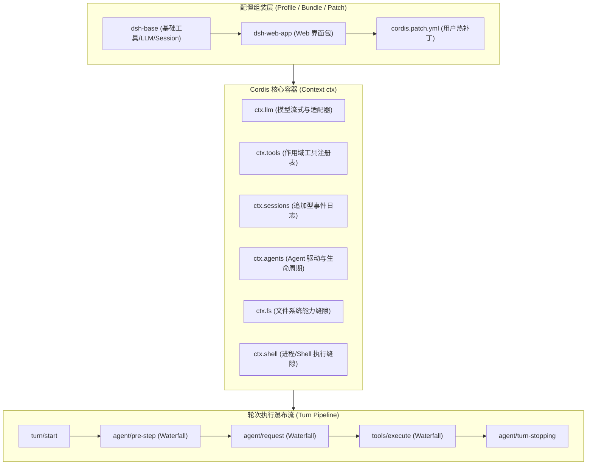
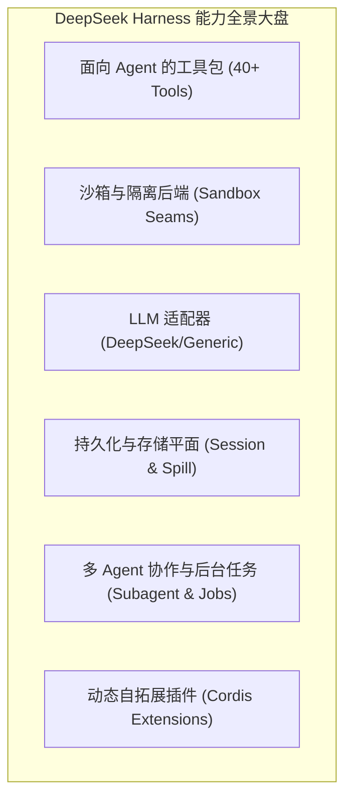
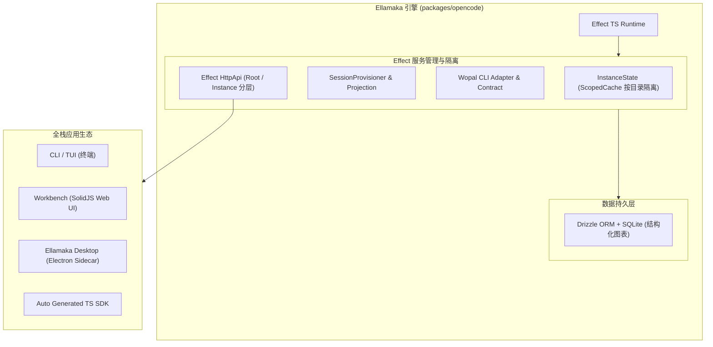

# DeepSeek Harness 架构与 Cordis 插件体系研究报告
—— 兼论与 Ellamaka 架构对比及未来演进路线

> **文档定位**：本报告深入解构 DeepSeek AI 开源的智能体框架 **DeepSeek Harness (`dsh`)** 及其核心底座 **Cordis 插件容器**。结合对 Java SPI、Spring DI、OSGi 等设计模式的对比，通俗拆解其微内核与响应式插件机制；同时对比 Ellamaka 的 Effect TS 架构体系，为 Ellamaka 后续的架构升级与演进提供系统性参考。

---

## 1. 研究背景与核心结论

随着 Agent 系统日益复杂，框架的设计哲学逐渐分化为两大阵营：
1. **轻量通用微内核阵营（以 DeepSeek Harness 为代表）**：追求“一切皆插件”（No Privileged Core），通过声明式配置和控制反转（IoC）实现模块的极度解耦与热插拔。
2. **强类型全栈工程化阵营（以 Ellamaka 为代表）**：追求“类型安全与空间感知”，利用 Effect TS 函数式引擎、InstanceState 隔离和双路由/全栈 UI，打造高精度的研发工作台。

**核心结论**：DeepSeek Harness 的 Cordis 容器在**抽象能力缝隙（Capability Seams）**、**可逆副作用（Reversible Side-Effects）** 与 **瀑布流拦截（Waterfall Pipeline）** 上设计极佳；而 Ellamaka 在**强类型工程安全**、**并发目录隔离** 与 **全栈多端形态** 上具备显著优势。Ellamaka 可在保持 Effect TS 强类型基石的前提下，吸收 Cordis 的“能力缝隙”与“瀑布拦截”思想，完成下一代架构升级。

---

## 2. DeepSeek Harness (`dsh`) 架构剖析

`dsh` 是一个完全建立在 Cordis 控制反转（IoC）框架上的 Agent 运行环境。它的整体架构如下图所示：



### 2.1 四大关键设计亮点

1. **无特权内核 (No Privileged Core)**：
   在 `dsh` 中，不存在传统的“固化内核代码”。LLM 适配器、工具注册表、Session 日志管理、甚至 Agent 循环驱动器本身，都只是一个普通的 Cordis 插件。
2. **声明式 Patch 重叠机制**：
   通过 `dsh --profile web --dump-config` 可以导出全量配置树。用户只需写一个 `cordis.patch.yml` 文件，就能按 ID 替换、覆盖或注入任意服务的实现，无需修改一行 TypeScript 源码。
3. **能力缝隙 (Capability Seams)**：
   将系统能力分拆为 `Service Definition`（接口定义）、`Service Provider`（服务提供方）和 `Consumer`（使用者）。例如 `ctx.fs` 和 `ctx.shell` 将底层物理环境抽象化，切换本地执行与远程云端沙箱（如 E2B、Docker）时，上层 Tool 完全无感。
4. **模型可见即已记录 (Model-visible is logged)**：
   系统以追加式日志（Append-only `SessionEvent` log）作为绝对的单一真相源（SSOT）。模型历史由 `deriveMessages()` 从日志派生，保证流式回放、Crash 恢复和 UI 状态同步的绝对一致。

---

## 3. DeepSeek Harness (`dsh`) 内置能力与插件全景大盘

DeepSeek Harness 在 `packages/` 目录下内置了超过 **50 个独立 npm 插件包**（`@deepseek-ai/dsh-*`），形成了极度丰富的工具与能力图谱。



### 3.1 面向 Agent 的核心工具能力包 (40+ Tools Catalog)

| 工具包名 | 模型可见工具名称 (`tool_name`) | 核心功能与能力说明 |
| :--- | :--- | :--- |
| `@deepseek-ai/dsh-tool-ask-user` | `ask_user_question` | **人类交互提问**：挂起 Agent 流程，弹出结构化 UI 问题（带单选/多选/推荐选项），等待用户确认或补全信息。 |
| `@deepseek-ai/dsh-tool-bash` | `bash` | **一次性 Bash 命令**：支持同步/后台异步运行 (`run_in_background`)，与后台 `ctx.jobs` 联动。 |
| `@deepseek-ai/dsh-tool-pwsh` | `pwsh` | **Windows PowerShell 支持**：针对 Windows 平台的 PowerShell 方言命令支持。 |
| `@deepseek-ai/dsh-tool-terminal` | `terminal_open`<br>`terminal_send`<br>`terminal_read`<br>`terminal_signal`<br>`terminal_close` | **全功能持久化 PTY 终端**：按 Agent 隔离的持久交互式终端，支持查看列表、发送按键信号和实时读取输出。 |
| `@deepseek-ai/dsh-tools` | `run_code` | **代码模式运行器**：在 Worker 线程/沙箱中直接运行原生的 TS/JS 代码，重重调用 SDK 函数。 |
| `@deepseek-ai/dsh-tool-fs` | `read`, `write`<br>`edit`, `read_image` | **原生文件系统读写**：包含先读后写策略门禁，`read_image` 原生加载图片并绑定持久附件。 |
| `@deepseek-ai/dsh-tool-fs-search` | `glob`, `grep` | **百万行代码高能检索**：嵌入原生 `@vscode/ripgrep`，极速实现代码全文正则匹配与文件 Glob 查找。 |
| `@deepseek-ai/dsh-tool-str-replace-editor` | `str_replace_editor` | **行内精准文本替换**：类似 Claude Code 的独立单行/字面量代码块替换编辑器。 |
| `@deepseek-ai/dsh-tool-subagent` | `subagent`<br>`subagent_fork` | **子智能体派生与委派**：派生同步前台或异步后台的 Subagent，`subagent_fork` 可分叉独立的会话分支。 |
| `@deepseek-ai/dsh-tool-subagent-control` | `send_message`<br>`interrupt_agent`<br>`list_agents` | **Subagent 管理控制台**：主 Agent 向后台运行的子 Agent 发送消息、中断执行或查询活跃智能体列表。 |
| `@deepseek-ai/dsh-tool-subagent-report` | `report` | **子 Agent 结果上报**：处于进程内的子 Agent 专用工具，向父 Agent 主动汇报阶段成果。 |
| `@deepseek-ai/dsh-tool-jobs` | `job_list`<br>`job_output`<br>`job_kill` | **通用后台任务管理器**：统一管理 Bash、Terminal、Subagent 等发起的后台 Job，读取异步输出或杀死进程。 |
| `@deepseek-ai/dsh-tool-lsp` | `lsp` | **语言服务协议 (LSP) 集成**：对接外部 stdio LSP，提供跳转定义、引用查找、诊断检查等 IDE 级能力。 |
| `@deepseek-ai/dsh-tool-web` | `web_search`<br>`web_fetch` | **网页搜索与提取**：搜索引擎调用与网页内容提取转化为 Markdown。 |
| `@deepseek-ai/dsh-tool-todo` | `todo_write` | **会话级动态 Todo 清单**：生成和更新可视化任务清单（TodoList）。 |
| `@deepseek-ai/dsh-tool-goal` | `create_goal`<br>`get_goal`<br>`update_goal` | **同会话多轮次目标跟踪**：建立长远目标、跨多轮次 Round 追踪和记录状态（Complete/Blocked）。 |
| `@deepseek-ai/dsh-schedule` | `schedule_create`<br>`schedule_list`<br>`schedule_delete` | **会话内定时器与 Cron**：创建定时一针提醒、延迟任务或固定频率定时操作。 |
| `@deepseek-ai/dsh-tool-session-query` | `session_search`<br>`session_trace`<br>`session_event_search` | **会话历史全量检索**：允许 Agent 搜索自己过去的历史会话、日志事件与决策血缘关系。 |
| `@deepseek-ai/dsh-tool-cordis` | `cordis_define`<br>`cordis_run`<br>`cordis_stop` | **Agent 自修改工具集**：**允许模型在运行时现场编写 TypeScript 插件代码并热挂载到 Harness 容器中！** |

---

### 3.2 其它底层核心能力服务插件

除了面向模型的工具外，`dsh` 还包含丰富的底层 Service 插件：

1. **沙箱与安全隔离 (Sandbox Seam)**：
   - `@deepseek-ai/dsh-sandbox`：基于 Linux **bwrap (Bubblewrap)**、**Landlock** 与 macOS **Seatbelt** 的本地安全沙箱。
   - `@deepseek-ai/dsh-e2b`：对接云端 E2B 容器沙箱的真实 Service Provider。
2. **LLM 模型适配层 (LLM Providers)**：
   - `@deepseek-ai/dsh-llm-deepseek`：DeepSeek 官方 API 特化适配器（支持思维链 CoT / DeepSeek-R1 格式解析）。
   - `@deepseek-ai/dsh-llm-pi-ai`：通用第三方 OpenAI / Anthropic / Vercel AI 协议兼容层。
   - `@deepseek-ai/dsh-llm-retry`：网络抖动指数退避重试中间件。
   - `@deepseek-ai/dsh-token-meter`：Token 实时计量与费用统计插件。
3. **数据与持久化平面 (Persistence & Storage)**：
   - `@deepseek-ai/dsh-session`：JSONL 追加日志 + SQLite 混合后端。
   - `@deepseek-ai/dsh-spill`：工具输出结果超长时的 Spill Store 分离存储策略。
   - `@deepseek-ai/dsh-attachment`：图片/大文本基于内容寻址（CAS）的本地文件存储。
4. **工作流与自愈 (Workflow Engine)**：
   - `@deepseek-ai/dsh-workflow`：Worker 线程工作流引擎，支持 Ralph 自动化工作流。
   - `@deepseek-ai/dsh-guard`：循环卫生守卫，检测重复无用工具调用并强制限制 Timeout。
   - `@deepseek-ai/dsh-skill`：技能系统，自动解析和加载 `SKILL.md` 指令文件。

---


## 3. Cordis 插件框架大白话深度解剖

### 3.1 什么是 Cordis？
用大白话来说：**Cordis 是一个面向 TypeScript 的“IoC 控制反转容器 + 自动可逆副作用管理器 + 瀑布流事件总线”**。

它解决了传统 Agent 开发中“硬编码依赖无法替换”和“动态卸载/热重载时定时器与监听器泄漏”两大痛点。

---

### 3.2 Cordis 与 Java 技术栈的透彻对标

对于熟悉 Java 架构的开发者，Cordis 框架并不是凭空产生的，它的设计思想可以完美映射到 Java 的成熟模式上：

| Cordis 概念 | Java 技术栈对标 | 大白话解释与异同对比 |
| :--- | :--- | :--- |
| **Service (`ctx.svc`)** | **Java SPI (`ServiceLoader`)** | **非常像！** 思想都是“面向接口/契约编程”。消费方只依赖服务名（如 `ctx.shell`），具体实现（LocalShell/DockerShell）由配置文件决定。 |
| **`inject: ['svc']`** | **Spring DI (`@Autowired`)** | **超越原生 SPI**：Cordis 拥有依赖图（DAG）自动推导能力。依赖不满足时插件自动处于 `PENDING` 状态，绝不报 NPE。 |
| **`Effect` & Disposer** | **OSGi Bundle Lifecycle** | **解决了资源清理**：插件挂载时创建的定时器、监听器都会返回 disposer（撤销函数）。卸载或热更新时自动倒序释放，绝不泄露内存。 |
| **`Waterfall` 模式** | **Koa / Express 洋葱模型 / Spring AOP** | **提供了控制流拦截**：监听器接收 `(args, next)`，可以用 `next()` 把入参传递给下一个插件，或者直接不调 `next()` 实现短路打断。 |

---

### 3.3 Cordis 5 大核心机制代码解析

#### ① Context（上下文容器 `ctx`）与声明合并
Cordis 使用 TS 的 **Declaration Merging** 扩展类型，获得完美的 IDE 自动补全：

```ts
declare module '@deepseek-ai/cordis' {
  interface Context {
    greeter: GreeterService // 扩充 ctx.greeter 类型
  }
}
```

#### ② Service 编写与依赖注入
```ts
// 1. 服务提供方
export class GreeterService extends Service {
  constructor(ctx: Context) {
    super(ctx, 'greeter') // 将自己注册到 ctx.greeter
  }
  greet(name: string) { return `Hello, ${name}!` }
}

// 2. 服务消费方（使用 inject 声明依赖）
export const inject = ['greeter']
export function apply(ctx: Context) {
  // 保证 ctx.greeter 绝不为 undefined
  console.log(ctx.greeter.greet('Wopal'))
}
```

#### ③ Effect 可逆副作用
```ts
export function apply(ctx: Context) {
  ctx.effect(() => {
    const timer = setInterval(() => console.log('tick'), 1000)
    return () => clearInterval(timer) // 卸载时自动清理
  })
}
```

#### ④ Waterfall 瀑布流拦截
```ts
// 拦截 Prompt 生成：追加安全规则，或危险指令直接打断
ctx.waterfall('agent/pre-step', (prompt, next) => {
  if (isDangerous(prompt)) return '请求已拦截' // 短路阻断
  return next(prompt + '\n[安全规则已注入]')   // 传递给下游
})
```

---

## 4. Ellamaka 架构解构与优势

Ellamaka 是面向 Wopal 空间生态的全栈工程级 Agent 引擎，其核心架构建立在 **Effect TS** 强类型响应式编程上：



### 4.1 Ellamaka 的 3 大核心优势

1. **Effect TS 函数式工程安全**：
   采用 `Schema.TaggedErrorClass` 显式抛出领域异常，利用 `Layer` 进行编译期依赖注入，通过 `Effect.forkScoped` 和 `Effect.addFinalizer` 保证极度严谨的资源回收。
2. **`InstanceState` 目录级并发隔离**：
   借助 Effect 的 `ScopedCache`，将 Workspace 级别的状态、文件监听与进程生命周期绑定在具体工作目录下。多窗口、多项目并发运行时互相绝对隔离。
3. **成熟的全栈多端生态**：
   具备完备的后端 HttpApi、自动生成的 TS SDK、SolidJS 研发工作台 (Workbench) 以及自带 Sidecar Supervisor 的 Electron 桌面应用。

---

## 5. 核心架构深度对比矩阵

| 比较维度 | DeepSeek Harness (`dsh`) | Ellamaka (`ellamaka`) | 对比总结与演进方向 |
| :--- | :--- | :--- | :--- |
| **内核解耦** | **极致解耦 (微内核)**<br>无特权内核，Agent Loop 只是插件 | **模块化 + 领域驱动**<br>以 OpenCode 为引擎基石，模块边界清晰 | `dsh` 的微内核非常适合热插拔；`ellamaka` 模块更利于大型工程维护。 |
| **类型系统** | **TypeScript + Cordis IoC**<br>通过字符串 Key 查找 Service | **Effect TS 强类型函数式**<br>编译期类型推导、Tagged Error、Schema | `ellamaka` 在类型安全和防崩溃上显著超越 `dsh`。 |
| **拦截管道** | **Profile Patch + Waterfall 拦截**<br>`next()` 瀑布管道拦截 Prompt/Tool | **Wopal Plugin SDK + OpenCode Hooks**<br>事件 Hook 机制与规则注入 | **`ellamaka` 可借鉴**：引入 Effect 风格的 Pipeline/Waterfall 拦截管道。 |
| **沙箱隔离** | **Capability Seams**<br>抽象 FS/Shell，无缝切云端沙箱 | **InstanceState + Resource Scope**<br>按工作目录 (Workspace) 强隔离 | **`ellamaka` 可借鉴**：在 Effect Layer 抽象中融入 `SandboxProvider` 接口。 |
| **数据存储** | **追加型 Event 日志**<br>从事件流完全派生历史消息 | **Drizzle ORM + SQLite 关系型**<br>结构化存储，支持树状 Session 投影 | `ellamaka` 具备更强的数据检索力；但可吸收 `dsh` 的“模型可见即日志”审计思想。 |
| **产品形态** | **CLI + 轻量 Web 原型** | **CLI + TUI + Web Workbench + Desktop** | `ellamaka` 具备完备的产品闭环能力。 |

---

## 6. 面向 Ellamaka 的架构升级与演进路线图

基于对 DeepSeek Harness 和 Cordis 的深度研究，建议 Ellamaka 在保持 **Effect TS 强类型基石** 的前提下，按以下路线推进升级：


### 6.1 演进建议 1：基于 Capability Seam 抽象 `SandboxProvider`
* **痛点**：当前 Ellamaka 的 Shell 执行（`ChildProcessSpawner`）和文件系统（`FileSystem`）主要针对本地环境。
* **方案**：借鉴 `dsh` 的能力缝隙思想，在 `packages/opencode/src/` 中抽象出 `ExecutionSandbox` Service。
* **效果**：实现本地进程执行与云端沙箱（E2B / Docker / 远程 Server）的无缝切换，上层 Tool 保持零改动。

### 6.2 演进建议 2：引入 Effect 风格的 Waterfall 瀑布拦截管道
* **痛点**：目前的 Plugin Hooks 多为通知性质，难以对 Prompt 生成、LLM 发送、工具执行入参进行拦截修改或主动打断。
* **方案**：设计基于 Effect 的链式 Pipeline 函数：
  ```ts
  // 伪代码：Effect 风格的瀑布流管道
  export type PipelineHandler<A> = (input: A, next: (updated: A) => Effect.Effect<A, PipelineError>) => Effect.Effect<A, PipelineError>
  ```
* **效果**：`.wopal/plugins/` 能够灵活插入中间件，动态改写规则、注入安全限制或按条件拒绝 Agent 的危险动作。

### 6.3 演进建议 3：实施“模型可见即已记录”审计推导机制
* **痛点**：在复杂的 Context Compact、Memory 检索或空间规则注入后，较难精确追溯模型单次请求所看到的完整 Prompt 拼接全貌。
* **方案**：在 Drizzle SQLite 中增加 `session_event_log` 表，所有被注入的系统提示词片段与上下文变更，均作为不可变 Event 追加记录。
* **效果**：提高 Agent 决策过程的可追溯性、回放重放能力与 Debug 效率。

---

## 7. 总结

DeepSeek Harness 与 Cordis 展现了微内核与动态插件架构的极致解耦美感，特别是在 Service/Inject 依赖驱动、可逆副作用和瀑布流拦截方面给出了极佳示范。而 Ellamaka 拥有更坚实的 Effect TS 类型防线与全栈产品形态。

通过吸收 Cordis 的“能力缝隙”与“瀑布拦截”优秀设计，Ellamaka 可以在不破坏现有工程安全性的基础上，实现架构灵活性与生态扩展力的全面飞跃。
