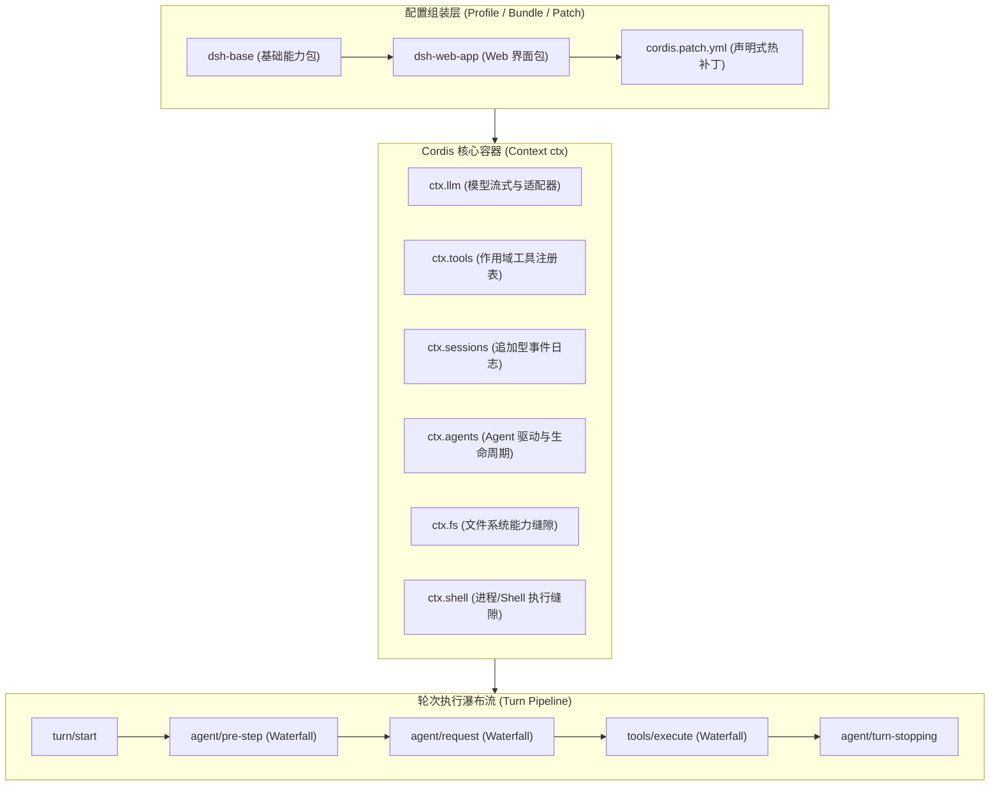
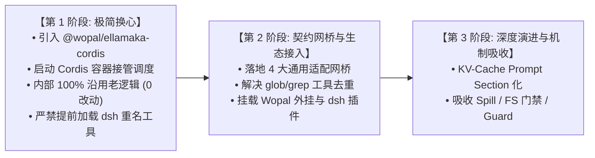
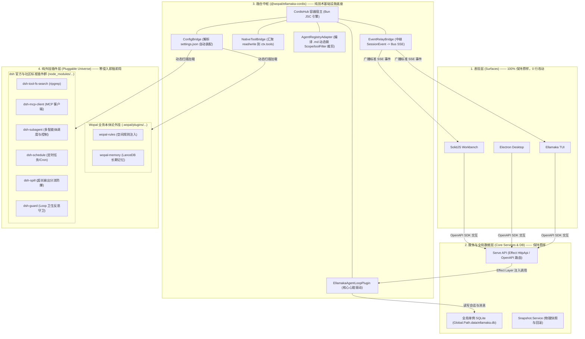
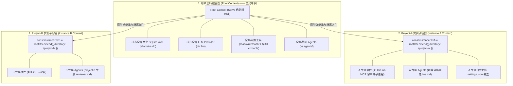
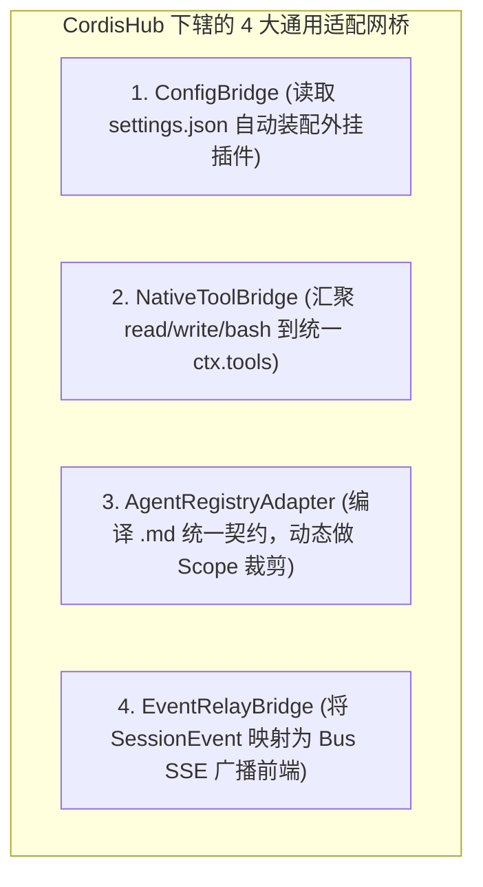

# DeepSeek Harness (dsh) 架构深度解构与 Ellamaka 融合演进研究报告

> **文档定位**：本报告对 DeepSeek AI 开源的智能体框架 **DeepSeek Harness (`dsh`)** 及其底层 **Cordis 插件容器** 进行了系统性的全景解构。对比 Ellamaka 的 **Effect TS** 架构体系，涵盖设计哲学、微内核插件机制、Skills/MCP、Subagent/命令/权限、API 范式、底层性能差异、Bun 运行时兼容性实测，并直面两套系统在数据模型与交互契约上的 4 大核心冲突。
> **方案状态**：本报告原方案部分（§6–§10：换心手术 + 4 大网桥 + dsh 插件生态挂载）已被后续深度审计修正并取代，正式设计见 **`../DESIGN-dsh-poc.md`**，修正摘要见 §6。§1–§5 的调研解构与对比分析、§11 的深耦合包机制复刻研究、§12 的工具集选型初步评估、§13 的 session 语义模型分析仍为有效参考。

---

## 1. 架构定位与设计哲学总览

当前 Agent 框架的设计哲学主要呈现出两大典型阵营：
1. **轻量通用微内核阵营（以 DeepSeek Harness 为代表）**：追求“一切皆插件”（No Privileged Core），通过 Cordis 控制反转（IoC）和声明式配置 Patch，实现核心组件的极度解耦与热插拔。
2. **强类型全栈工程化阵营（以 Ellamaka 为代表）**：追求“类型安全与空间感知”，利用 Effect TS 函数式引擎、InstanceState 目录隔离、OpenAPI 标准和全栈多端产品（CLI/TUI/Web/Desktop），打造高精度的研发工作台。

| 核心维度 | DeepSeek Harness (`dsh`) | Ellamaka (`ellamaka`) |
| :--- | :--- | :--- |
| **定位** | 通用微内核 Agent Harness 基础设施 | 面向 Wopal 空间生态的全栈工程级 Agent 引擎与工作台 |
| **控制流底座** | Cordis IoC 容器，无特权内核（No Privileged Core） | OpenCode 执行引擎 + Effect TS 声明式组合 |
| **运行时环境** | Node.js (V8) + tsx / tsdown | **Bun (JavaScriptCore + Zig)** |
| **API 范式** | RPC-First (Typert 远程方法网关) | RESTful Resource-First (Effect HttpApi + OpenAPI) |
| **配置机制** | Profile + Bundle + 声明式热补丁 (`cordis.patch.yml`) | 多层级配置（`.wopal/` 本体论与 `.wopal-space/` 运行时） |

---

## 2. DeepSeek Harness (`dsh`) 底座与微内核全景解构

`dsh` 是一个完全建立在 Cordis 控制反转（IoC）框架上的 Agent 运行环境：



### 2.1 四大关键设计亮点

1. **无特权内核 (No Privileged Core)**：
   在 `dsh` 中，不存在传统的“固化内核代码”。LLM 适配器、工具注册表、Session 日志管理、甚至 Agent 循环驱动器本身，都只是一个普通的 Cordis 插件。
2. **声明式 Patch 重叠机制**：
   通过 `dsh --profile web --dump-config` 可以导出全量配置树。用户只需编写 `cordis.patch.yml`，即可按 ID 替换、覆盖或注入任意服务实现，无需修改一行 TypeScript 源码。
3. **能力缝隙 (Capability Seams)**：
   将系统能力拆解为 `Service Definition`、`Service Provider` 和 `Consumer`。例如 `ctx.fs` 和 `ctx.shell` 将底层物理环境抽象化，切换本地执行与远程云端沙箱（如 E2B、Docker）时，上层 Tool 完全无感。
4. **模型可见即已记录 (Model-visible is logged)**：
   以追加式日志（Append-only `SessionEvent` log）作为单一真相源（SSOT）。模型历史由 `deriveMessages()` 从日志派生，保证流式回放、Crash 恢复和 UI 状态同步的绝对一致。

---

### 2.2 内置能力与 50+ 插件全景大盘

DeepSeek Harness 在 `packages/` 目录下内置了超过 **50 个独立 npm 插件包**（`@deepseek-ai/dsh-*`），提供 40+ 面向模型的丰富工具：

| 分类 | 插件包名 | 模型可见工具 (`tool_name`) | 核心功能与能力说明 |
| :--- | :--- | :--- | :--- |
| **人类交互** | `@deepseek-ai/dsh-tool-ask-user` | `ask_user_question` | 挂起 Agent 流程，弹出带有单选/多选/推荐项的结构化问卷，等待人类确认。 |
| **终端与命令** | `@deepseek-ai/dsh-tool-bash`<br>`@deepseek-ai/dsh-tool-terminal` | `bash`, `pwsh`<br>`terminal_open`, `terminal_send` 等 | 支持一次性脚本（异步后台 `run_in_background`），以及全功能按 Agent 隔离的持久 PTY 交互终端。 |
| **文件与编辑** | `@deepseek-ai/dsh-tool-fs`<br>`@deepseek-ai/dsh-tool-str-replace-editor` | `read`, `write`, `edit`<br>`str_replace_editor` | 包含“先读后写”策略门禁、图片加载；以及类似 Claude Code 的独立单行/文本块替换编辑器。 |
| **代码大盘搜索**| `@deepseek-ai/dsh-tool-fs-search` | `glob`, `grep` | **极速全文代码搜索**：嵌入原生 `@vscode/ripgrep` 二进制，无需宿主机安装即可做百万行代码正则与文件名检索。 |
| **多 Agent 协作**| `@deepseek-ai/dsh-tool-subagent`<br>`@deepseek-ai/dsh-tool-subagent-control` | `subagent`, `subagent_fork`<br>`send_message`, `interrupt_agent` | 派生前后台子 Agent 或独立 Fork 会话；主 Agent 可向后台子 Agent 发送消息、查询状态或中断执行。 |
| **通用后台任务**| `@deepseek-ai/dsh-tool-jobs` | `job_list`, `job_output`, `job_kill` | 统一管理 Bash、Terminal、Subagent 等发起的后台任务，随时获取异步输出或终结 Job。 |
| **IDE 与 LSP** | `@deepseek-ai/dsh-tool-lsp` | `lsp` | 通过 stdio 对接外部 Language Server Protocol，提供代码补全、转到定义、语法诊断。 |
| **目标与定时器**| `@deepseek-ai/dsh-tool-goal`<br>`@deepseek-ai/dsh-schedule` | `create_goal`, `update_goal`<br>`schedule_create`, `schedule_list` | 同会话多轮次（Round）目标追踪，以及会话内定时器提醒与 Cron 任务。 |
| **历史检索** | `@deepseek-ai/dsh-tool-session-query` | `session_search`, `session_trace` | 允许 Agent 检索自己过去的所有历史会话、日志事件与决策血缘关系。 |
| **Agent 自修改** | `@deepseek-ai/dsh-tool-cordis` | `cordis_define`, `cordis_run` | **允许模型在运行时现场编写 TypeScript 插件代码并热挂载到 Harness 容器中！** |
| **沙箱隔离** | `@deepseek-ai/dsh-sandbox`<br>`@deepseek-ai/dsh-e2b` | *(底层 Service)* | 本地 bwrap/Seatbelt 沙箱与云端 E2B 容器沙箱。 |
| **LLM 适配** | `@deepseek-ai/dsh-llm-deepseek`<br>`@deepseek-ai/dsh-llm-pi-ai` | *(底层 Service)* | DeepSeek 官方 API（深度适配 R1 思考链 CoT）与通用第三方协议兼容层。 |

---

### 2.3 抛开插件架构：dsh 内部 8 大极高价值硬核技术资产

即使不直接套用 dsh 的 Cordis 底座，`dsh` 内部针对真实工业级研发场景打磨出的 **8 大硬核技术机制**，具有极高的工程借鉴与复用价值：

1. **🚰 `Spill Store`（超长工具输出自动分流转储）**：
   - 自动拦截超过 `maxInlineBytes` 阈值的纯文本工具结果（挂在 `tools/post-execute` waterfall），全文转储到 Spill Store 后端，向模型返回**头尾预览**（预览预算对半分配给首尾，且替换通知的字节数在预算内预留，保证替换后总长严格不超过阈值）与定位句柄（`spill://...`）；转储失败时降级保留原文，并跳过 `read` 工具防止读-转-读循环。（依据 `spill-policy/src/index.ts` 源码，2026-08-16 勘误：原文"仅返回前 50 行摘要"与实现不符）
2. **⚡ `Code Mode`（代码执行模式与原子并发调度）**：
   - 允许模型直接编写 TypeScript 脚本，在沙箱内原生并发调用多个子工具，单轮次聚合返回，大幅缩短网络往返并节省 Token。
3. **🛡️ `FS Observation Policy`（先读后写强制观察门禁）**：
   - 维护会话级已读文件列表，未被 `read` 过的文件被禁止执行 `write`/`edit`，从根本上防止凭幻觉盲写破坏代码。
4. **🚨 `Loop Hygiene Guard`（循环卫生守卫 / 死循环阻断）**：
   - 实时检测动作相似度与重复报错，在 Prompt 中动态注入反思警示，并在恶性循环时强制终止轮次。
5. **🧠 `DeepSeek-R1` 思考链（CoT）流式状态机**：
   - 双通道流式状态机，将思考流（`<think>`）、正式文本流与 Tool Call 严格分离解耦。
6. **🔍 跨会话历史检索与决策血缘图谱 (`Session Query`)**：
   - 提供 `session_search` 和 `session_trace` 工具，支持 Agent 自主检索以往会话中的决策日志与避坑记录。
7. **💻 原生持久化 PTY 终端 (`dsh-tool-terminal`)**：
   - 维护按 Agent 隔离的真实伪终端会话，支持后台长驻服务（`npm run dev`）与按键信号交互。
8. **🧬 运行时动态自拓展 (`Self-Referential Toolset`)**：
   - 提供 `cordis_define` / `cordis_run`，模型在缺少工具时可现场编写 TypeScript 插件代码并在当前容器中即时热挂载。

---

## 3. 插件依赖解耦考证与 Bun 运行时兼容性实测

### 3.1 源码考证：dsh 插件到底依赖什么？

深入查阅 `dsh` 核心插件源码（如 `packages/fs/tool-fs-search/src/index.ts`）：
```typescript
export const inject = ['tools', 'systemPrompt', 'subprocess']
```
* **工具插件是提供方（Provider）**：它们只负责将自身注册到 `ctx.tools`；
* **Agent Loop 只是消费者（Consumer）**：工具插件**完全不依赖 `agentLoop`，也完全不依赖某款特定的 LLM 适配器**，具备高度的独立性与可移植性。

---

### 3.2 Bun 运行时兼容性

> **勘误（2026-08-16）**：本节表格原文标注为"实测"，但写作当时并无实测证据——dsh 仓库 CI（`.github/workflows/`）全部为 Node（node24），无任何 Bun 配置，下表实为基于依赖类型的推断性结论。后续已由真实冒烟测试补验部分内容：`@deepseek-ai/cordis@4.0.1` 在 Bun 1.3 下服务注册、inject 依赖、事件系统、`ctx.fiber.dispose()` 生命周期全链路可用（init 1.79ms）。插件级兼容性未逐包实测，实际挂载时须按契约符合性冒烟测试逐个验证（见 `../DESIGN-dsh-poc.md` §4.1）。

| 插件类别 | 代表插件 | 底层依赖 | Bun 兼容性预期（推断，未逐包实测） |
| :--- | :--- | :--- | :--- |
| **纯 TS 算法/逻辑** | `dsh-skill`, `dsh-spill` | 纯 TS 数据结构与算法 | 预期兼容（cordis 本体已实测通过）。 |
| **网络与协议客户端** | `dsh-mcp-client`, `dsh-e2b`, `dsh-llm-*` | `fetch`, `WebSocket`, `http` | 预期兼容，挂载前逐个冒烟。 |
| **子进程调用** | `dsh-tool-fs-search` (ripgrep) | `@vscode/ripgrep` + `child_process` | 预期兼容（Bun 实现 child_process API），挂载前逐个冒烟。 |

> 注：`dsh-guard` 为目录名而非单一插件（实际为 repeat-tool-reminder 与 timeout-policy 两个包），原表归类有误，已从代表插件列移除。

---

## 4. API 范式与性能底座深度对比

### 4.1 性能评测与框架权衡

| 评估维度 | DeepSeek Harness (`dsh`) | Ellamaka (`ellamaka`) | 胜出方与简评 |
| :--- | :--- | :--- | :--- |
| **运行时底座性能** | Node.js (V8) | **Bun (JSC + Zig)** | 🏆 **Ellamaka 胜出**（冷启动 **10~30ms vs 100~300ms**，I/O 吞吐领先） |
| **并发与中断控制** | 传统 Promise + AbortSignal | **Effect Fiber 结构化并发** | 🏆 **Ellamaka 胜出**（零悬挂任务，秒级确定性级联中断） |
| **协议通信开销** | **Typert 扁平 RPC 网关** | RESTful HttpApi 路由树 | 🏆 **dsh 胜出**（单路由分发，协议开销极小） |
| **架构鲁棒与防崩溃**| 动态依赖检查，运行时 Codec | **Effect TS 编译期类型检查** | 🏆 **Ellamaka 胜出**（`Schema.TaggedErrorClass` 消除未处理异常） |
| **复杂数据检索** | 追加日志重放 | **SQLite 关系型索引查询** | 🏆 **Ellamaka 胜出**（结构化会话树秒级投影检索） |
| **生态标准化** | 私有 AST 生成体系 | **OpenAPI 3.1 工业标准** | 🏆 **Ellamaka 胜出**（全栈与多端跨语言接入更开放） |

---

## 5. 直面现实：两套体系的 4 大核心冲突

1. **运行时底座冲突**：Bun (Ellamaka) vs Node.js (dsh CLI)。
2. **配置系统冲突**：静态 JSON/TS (`settings.json`) vs Cordis Loader YAML 树与 Patch。
3. **数据模型契约冲突**：结构化 `Part` 模型 (存 SQLite) vs 追加型 `SessionEvent` 流。
4. **交互式 UI 契约冲突**：如 `ask_user_question` 问卷插件，dsh 发送自定义 JSON，若直接推给 Ellamaka 前端只会作为原始字符串显示。

---

## 6. 方案演进说明（原方案已被取代）

> 原文档本节至 §10 提出的融合方案（Cordis 换心手术、4 大通用适配网桥、dsh 插件生态挂载、三阶段路线）已被后续深度审计修正并取代。**正式设计真相源：`../DESIGN-dsh-poc.md`**。原文以折叠形式存档，仅作历史参考。

**审计修正的关键发现**：

1. **原 §8.3 POC 代码存在 API 虚构**：`SessionProcessor.processTurn(sessionID)` 不存在（真实 API 为 `SessionProcessor.Service.create()` 返回 `Handle`，经 `handle.process(streamInput)` 驱动）；`ctx.dispose()` 在 Cordis v4 中应为 `ctx.fiber.dispose()`。
2. **原方案低估了 dsh 插件的挂载成本**：dsh 工具插件 inject 的 `tools`/`systemPrompt`/`subprocess` 是 dsh 核心服务，深层依赖 `dsh-session` 事件日志。464 包审计将插件按 session 依赖分为三梯队：约 40 个零依赖（接触面仅 `session.header` 只读；2026-08-17 勘误：此处的「零依赖」指运行时零依赖——spill 栈经 required peer 引入 dsh-session 仅供 `SessionId` 类型解析，`import type` 编译期擦除，运行时不加载，已由 `packages/ellamaka-cordis/test/forbidden-load.test.ts` 加载探针实证）、仅 tool-todo 需 `append()` 单方法、session-query/subagent/schedule/compaction/agent-loop 为深耦合梯队——而深耦合梯队的全部能力 ellamaka 已自持。
3. **§3.2 的 Bun 兼容性"实测"当时无证据**：后续已由真实冒烟测试补验证，结论成立（Cordis 4.0.1 在 Bun 1.3 下服务注册/inject/事件/销毁全链路可用，init 1.79ms）。

**新方案核心**（详见 `../DESIGN-dsh-poc.md`）：

- 目标修正为 **ellamaka 自身以 Cordis 为组合层运行时**：loop 渐进插件化（非换用 dsh loop），session 持久化/事件/API 零变更；
- 服务契约自持锁死（Q2），dsh 梯队 1 插件经契约符合性验证后滚动挂载（Q3）；
- **ctx.tools 单管道收敛 + opencode 权限剥离为同一核心工程**（Q1，姿势 B）；
- 迁移路径为 Step A–E：宿主化 → 契约下沉 → 单管道收敛/权限剥离 → 模块拆解 → 可选清理，每步独立有价值、可停、可回滚。

<details>
<summary>原方案存档（§6–§10，已被取代，仅作历史参考）</summary>

## 6. 演进路线规划：三阶段稳健推进



---

## 7. 融合适配体系全景架构与目标构想（终极设计蓝图）

为了在享受 Cordis 微内核插件化红利的同时，100% 保护现有的前端资产与多 Instance 隔离机制，我们构建了以下四层全景架构体系：

### 7.1 四层全景架构图



---

### 7.2 多 Instance 架构与 Cordis 原型链派生（Root Context $\rightarrow$ Instance Context）

Ellamaka 的核心特征是单进程 `Serve` 托管多个项目目录（`InstanceState`）。我们利用 Cordis 原生的 **“父子原型链上下文派生（`rootCtx.extend()`）”** 完美实现隔离与继承：



* **配置与能力合并**：`instanceCtxA` 在解析配置时，将全局配置与项目 `.wopal/config/settings.json` 做 `mergeDeep` 深度合并；同名 Agent（如 `.wopal/agents/fae.md`）自动在子 Context 中**遮蔽（Shadow）**全局定义。
* **全局能力回溯**：`instanceCtxA` 在执行时，未被覆盖的工具与 LLM 连接自动沿着原型链回溯到 `Root Context`。
* **资源精确释放**：当 `/project-a` 关闭时，调用 `await instanceCtxA.dispose()`，**仅释放该项目特有的 MCP 进程与定时器，全局 SQLite 与 LLM 连接毫发无损！**

---

### 7.3 四大通用适配网桥设计细节



#### 1. `ConfigBridge`（单一配置源装配器）
* **单一真源**：以 `.wopal/config/settings.json` 为唯一配置入口；
* **工作逻辑**：遍历 `plugins` 字段，调用 `ctx.plugin(name, config)`，插件内部自带的 `@deepseek-ai/schemastery` 自动完成参数校验与默认值填补。

#### 2. `NativeToolBridge`（统一工具注册中枢）
* **命名规范**：原生内置工具（`read`, `write`, `edit`, `bash`）、Wopal 工具（`wopal_*`）、dsh 工具（`glob`, `grep`）、MCP 工具（`mcp__<server>__<tool>`）；
* **唯一注册表**：将所有来源的工具统一包装并注册进 `ctx.tools`，建立全系统单一权威注册表。

#### 3. `AgentRegistryAdapter`（契约中心化智能体管理）
* **统一契约模型（`AgentManifest`）**：
  ```typescript
  export interface AgentManifest {
    id: string
    name: string
    description: string
    model?: string
    prompt: string
    permission?: 'read-only' | 'workspace-write' | 'danger-full-access'
    tools?: { allow?: string[]; deny?: string[] }
    skills?: string[]
  }
  ```
* **动态隔离（Scope Activation）**：在 Agent 会话创建瞬间，为其创建独立 Cordis `Scope`，自动执行 `systemPrompt.section` 置顶人设，并调用 `tools.restrict(manifest.tools)` 进行物理级工具黑白名单裁剪。

#### 4. `EventRelayBridge`（双向事件中继网桥）
* **事件映射表**：
  
  | Cordis / dsh 事件 | 转换动作 | 映射到 Ellamaka 的 SSE 事件 | 前端消费行为 |
  | :--- | :--- | :--- | :--- |
  | **`assistant/chunk`** | 提取 text / reasoning | `message.part.delta` | SolidJS 前端逐字追加渲染（流式打字）。 |
  | **`tool/call`** | 提取 tool_name, call_id, args | `tool.call.started` | 前端展开 `ToolCard` 显示“正在执行...”。 |
  | **`tool/result`** | 提取 output, is_error | `tool.call.completed` | 前端更新 `ToolCard` 显示结果/Diff。 |
  | **`user/question`** | 提取 question, options | `question.asked` | 前端弹出 `QuestionPrompt` 交互选择框。 |

---

## 8. 第一阶段落地工程：极简“换心手术”架构设计与 POC 验证

第一步手术遵循 **“最小切口、零回归风险、绝不提前扩大范围”** 的严格工程原则。

### 8.1 第一步的严格边界定义（什么做，什么坚决不做）

* ✅ **第一步要做的事**：
  1. 在 `projects/ellamaka/packages/ellamaka-cordis/` 创建独立的专用基础设施包（包名 `@wopal/ellamaka-cordis`）；
  2. 实现 `CordisHub`，在 Bun 运行时中拉起 `new Context()` 容器作为生命周期宿主；
  3. 实现 `EllamakaAgentLoopPlugin`，将 `processor.ts` 的执行入口包装为 Cordis 插件调度；
  4. 在 `Serve` 中通过 Effect Layer 注入该 Hub，跑通现有的多轮对话。
* 🛑 **第一步坚决不做的事（杜绝空想与冲突）**：
  1. **不碰 SQLite 数据库**：数据库继续通过现有的 Effect `Storage.Service` 访问全局共享库 `ellamaka.db`，**绝对不在 Cordis 中包装 SQLite**；
  2. **不碰 LLM 适配器**：模型通信继续走现有的 Effect `Provider.Service`，**绝对不在 Cordis 中包装 LLM**；
  3. **不碰原生工具管道**：原生工具继续走现有流程，**绝对不把原生工具迁移进 Cordis**；
  4. **严禁加载 dsh 的基础工具插件**：因为 dsh 的 `dsh-tool-fs-search` 中包含同名的 `glob` 和 `grep`，第一步若加载必产生命名冲突。

---

### 8.2 独立包 `@wopal/ellamaka-cordis` 极简源码结构

```text
packages/ellamaka-cordis/  (包名: @wopal/ellamaka-cordis)
├── package.json
├── tsconfig.json
├── README.md
└── src/
    ├── index.ts                     # 统一导出 CordisHub, CordisHubLive
    ├── hub.ts                       # ⭐ CordisHub: 管理 Cordis 根容器与生命周期
    ├── layer.ts                     # Effect Layer: CordisHubLive (供 Serve 一行加载)
    └── core/
        ├── ellamaka-loop.plugin.ts  # 把现有的成熟 processor.ts 包装为 Cordis 插件
        └── types.ts                 # declare module '@deepseek-ai/cordis' 类型扩展
```

---

### 8.3 第一步代码实现透视（极简纯粹，不到 100 行真实代码）

> **⚠️ 勘误（2026-08-16）**：本节代码**从未通过编译验证，含两处虚构 API，不可直接使用**：
> 1. `SessionProcessor.processTurn(sessionID)` 不存在——真实 API 为 `SessionProcessor.Service.create(input)` 返回 `Handle`，经 `handle.process(streamInput)` 驱动（见 `packages/opencode/src/session/processor.ts`）；
> 2. `ctx.dispose()` 在 Cordis v4 中不存在——真实销毁 API 为 `ctx.fiber.dispose()`（见 `vendor/cordis/src/fiber.ts`，已经 Bun 实测验证）。
> 正式设计见 `../DESIGN-dsh-poc.md`。

#### 1. 核心换心驱动（`src/core/ellamaka-loop.plugin.ts`）
```typescript
import { Context, Service } from "@deepseek-ai/cordis"
import { Runtime } from "effect"

export interface AgentLoopService {
  processTurn(sessionID: string): Promise<void>
}

declare module "@deepseek-ai/cordis" {
  interface Context {
    agentLoop: AgentLoopService
  }
}

export class EllamakaAgentLoopPlugin extends Service {
  static name = "agentLoop"

  constructor(ctx: Context, private effectRuntime: Runtime.Runtime<any>) {
    super(ctx, "agentLoop")
  }

  // 纯粹的调度外壳：直接桥接调用现有的成熟 processor，内部零改动！
  async processTurn(sessionID: string): Promise<void> {
    const { SessionProcessor } = await import("@opencode-ai/opencode/session/processor")
    await Runtime.runPromise(this.effectRuntime)(SessionProcessor.processTurn(sessionID))
  }
}
```

#### 2. 核心中枢宿主（`src/hub.ts`）
```typescript
import { Context as CordisContext } from "@deepseek-ai/cordis"
import { EllamakaAgentLoopPlugin } from "./core/ellamaka-loop.plugin"

export class CordisHub {
  readonly ctx: CordisContext

  constructor(options: { effectRuntime: any }) {
    // 1. 在 Bun 主进程内初始化 Cordis 根容器
    this.ctx = new CordisContext()

    // 2. 仅挂载换心驱动，接管调度
    this.ctx.plugin(EllamakaAgentLoopPlugin, options.effectRuntime)
  }

  async dispose() {
    await this.ctx.dispose()
  }
}
```

#### 3. Effect Layer 注入（`src/layer.ts`）
```typescript
import { Layer, Effect } from "effect"
import { CordisHub } from "./hub"

export const CordisHubLive = Layer.scoped(
  CordisHub,
  Effect.gen(function* () {
    const runtime = yield* Effect.runtime()
    const hub = new CordisHub({ effectRuntime: runtime })
    
    // 由 Effect 严格把控容器生命周期
    yield* Effect.addFinalizer(() => Effect.promise(() => hub.dispose()))
    return hub
  })
)
```

---

### 8.4 第一阶段 POC 验收标准

| 验收项目 | 验证动作 | 成功标准（Pass 准则） |
| :--- | :--- | :--- |
| **容器初始化** | 在 Bun 运行时下启动 `CordisHubLive`。 | Bun 进程成功拉起 Cordis 容器，日志无报错，耗时 `<5ms`。 |
| **调度闭环** | 通过 Workbench 或 TUI 发起一次多轮对话任务。 | 对话正常进行，流式打字正常，Drizzle SQLite 正常写入，Snapshot 快照正常生成，**全链路 100% 零回归**！ |
| **容器安全销毁** | 终止服务进程。 | Cordis 容器触发 `dispose()` 顺利注销，无悬挂句柄或内存泄漏。 |

---

## 9. 第二阶段落地：网桥适配与插件生态挂载

在第一阶段 POC 验证成功、证明“换心不改血脉”成立后，我们在第二阶段推进网桥治理与插件接入：

1. **`NativeToolBridge` 与工具去重**：
   - 梳理原生工具与 dsh 工具命名空间，对同名的 `glob`/`grep` 确立优先级；
   - 将确认无冲突的工具统一切入 `ctx.tools`。
2. **`ConfigBridge`**：
   - 解析 `settings.json` 的 `plugins` 声明，支持按需挂载 dsh 官方插件与 Wopal 外挂插件。
3. **`AgentRegistryAdapter`**：
   - 解析 `.wopal/agents/*.md`，利用 Cordis 的 `Scope` 实现动态 `toolFilter` 裁剪。
4. **`EventRelayBridge`**：
   - 将 Cordis 的 `SessionEvent` 映射为现有的 Bus SSE 事件推给前端。

---

## 10. 后续精细化演进：Agent Loop 内部改造架构思路

在底座与插件体系全部打通后，后续可对 Agent Loop 内部进行精细化优化，吸收 dsh 的工业级优秀机制：

* **KV-Cache 前缀保护**：将提示词集中拼装重构为标准的 **Prompt Section 段落系统**（静态基底设定置顶、动态时间戳/提醒置底），吃满模型厂商的 KV Cache 缓存折扣；
* **`dsh-spill`**：超长工具输出（>20KB）自动分流转储到本地 Spill Store，仅向模型返回摘要与 `spill://` 句柄，防爆上下文；
* **`fs-observation-policy`**：先读后写强制观察门禁，未被 `read` 过的文件禁止调用 `write`/`edit`，根治模型盲写幻觉；
* **`dsh-guard`**：死循环检测与 Prompt 动态反思自愈守卫；
* **`Code Mode`**：支持模型编写 TypeScript 脚本在 Worker 沙箱内原子并发调用多工具。

---

### 💡 总结

通过 **第一步严格聚焦极简“换心手术”**，我们在零风险、零回归的前提下完成了 Bun 运行时中 Cordis 容器的底座验证；在第二阶段通过 **4 大通用网桥与多 Instance 映射** 实现了完整的插件化生态融合；并在第三阶段稳步吸收 dsh 的进阶机制。整套方案层次分明、张弛有度、具备极高的工业级工程落地价值！

</details>

---

## 11. 深耦合包机制复刻研究（2026-08-16 补充）

> **研究定位**：正式设计（`../DESIGN-dsh-poc.md`）将 dsh 的 agent-loop/session/session-query/compaction/subagent/schedule 六个包划为深耦合禁区（红线 §7）——它们 rt-import `dsh-session` 且能力与 ellamaka 自持体系重叠。但禁区针对的是**包与数据模型**，不是**机制设计**。本章对六包逐一审计其可剥离的机制闪光点（全部经源码实证），并给出复刻路径分析。复刻的落地排期归正式设计文档管辖，本章只做研究判定。

### 11.1 闪光点清单（源码实证）

| 包 | 闪光点 | 源码实证 | ellamaka 现状对比 |
|----|--------|---------|------------------|
| **agent-loop** | **Inbox 两级消息队列**：`{ 'next-turn': [], 'next-step': [] }`——agent 运行中用户新消息可精确定位"下一步注入"或"下一轮生效"，队列状态可从事件日志重放重建；`claimed`/`discarded`/`inserted` 全程留痕 | `packages/core/agent/src/inbox.ts`（state 结构、replay-once projection、`splice('next-step', ...)` 清空语义） | `SessionRunState.assertNotBusy`——busy 即拒绝，无排队语义；运行中追加消息的交互体验存在空白 |
| **session** | **日志格式前向容错**：`SESSION_FORMAT_VERSION` 单调递增 + 未知事件类型 `ignorable` 信封——旧版本读取新版本日志不崩溃，仅在结构性变更时升版本号 | dsh AGENTS.md"SessionEventMap member is required-on-read by default... unless the event carries the envelope's `ignorable: true`"机制（`.agents/notes/implemented/architecture/2026-08-10-session-log-version-mechanism.md`） | EventV2 定义含 `version` 字段，但消费侧缺"未知事件类型容错读取"策略 |
| **session-query** | **4 个自检索工具**：`session_search`（跨会话工作检索）/`session_event_search`（事件级搜索）/`session_trace`（决策血缘）/`session_event_read`（精确读取）；corpus 解析采用 live 优先 + 持久层回退（`LogicalSession`/`LogicalSessionSource` 借用与克隆语义） | `packages/session-query/tool-session-query/src/index.ts`（4 工具 schema）、`session-query/src/corpus.ts` | 无对应能力——agent 无法检索自己的历史会话与决策 |
| **compaction** | **tool-result-pruner 确定性裁剪**：head/middle/tail 分段裁剪 + `PRUNE_MARKER` 占位 + shadow-price 事件（重放可恢复被裁内容）；自称 **"Replay-safe, model-free"**——裁剪零 LLM 调用 | `packages/compaction/compaction-tool-result-pruner/src/index.ts`（`Deterministic head/middle/tail pruning`、`compaction/prune` shadow-price 事件） | compaction 全靠 LLM 总结（`session/compaction.ts`），无确定性前置裁剪层 |
| **subagent** | **多后端 Provider 架构**：claude-code/codex/acp/dsh-sdk/spawn-in-process/fork-in-process 六种后端实现同一缝隙契约；scope-filtered 生命周期事件分发；`run-settlement` 结算 | `packages/subagent/`（Service Definition + 6 个 provider 包、`run-settlement.ts`） | `tool/task.ts` 单后端（内部 session 复用，`TaskPromptOps`）；无外部引擎后端、无父子持续通信 |
| **schedule** | **会话内定时器三态**：`after_seconds`/`at`/`every_seconds` 三种定时；持久化 + durability preflight（重启后重建未触发的定时器）；到点唤醒 agent 继续工作；`schedule_create/list/delete` 工具面 | `packages/schedule/schedule/src/runtime.ts`（MAX_TIMER_DELAY 处理、timer 派生、dispose 语义）、`tools.ts`（3 工具与"持久化不确定时提示 schedule_list 复核"的防御性文案） | 无对应能力；wopal 生态的 flex-scheduler 是进程外 CRON 系统，会话内定时属于互补空白 |

### 11.2 复刻方法论：三类形态 + 接口映射

复刻的对象是机制设计，不是包。每个闪光点剥离 session 耦合后归入三种形态之一：

- **A 类 — 算法吸收**：机制本质是纯逻辑，session 只是输入输出载体。将算法提为纯函数/策略，嵌入 ellamaka 现有 Effect 服务实现。不依赖 Cordis 化，可先行。
- **B 类 — 能力插件**：新能力天然是插件形态（工具、后台服务）。自研实现 + 按 `@wopal/ellamaka-cordis` 自持契约封装，底层接 ellamaka Storage/Bus。依赖 Step B/C 契约就绪。
- **C 类 — 现状增强**：ellamaka 已有对应能力，仅缺 dsh 的某个精妙语义。将语义 diff 移植进现有实现，不新增形态。

session 接触面到 ellamaka 对应物的翻译表（全部复刻共用）：

| dsh 侧接触面 | ellamaka 对应物 |
|-------------|----------------|
| `session.events` 日志重放 | Storage SQL 查询（结构化查询优于日志重放） |
| `session.append(event)` | EventV2 发布 + SQLite 写入 |
| `agent.send(userMessage)` / wake | `SessionPrompt.prompt()` 触发 |
| `tokenMeter` 计价 | LLM Usage（processor 已有） |
| Cordis scope 隔离 | instance context（Step B 后） |

### 11.3 逐项复刻判定

| 闪光点 | 形态 | 复刻要点 | 前置依赖 | 成本 |
|--------|------|---------|---------|------|
| tool-result-pruner | **A** | 裁剪算法（阈值/head/middle/tail/marker）提为纯函数；嵌入 compaction 流程：LLM 总结前先确定性裁剪旧工具结果；裁剪记录对应物写入 EventV2 | 无（可先于 Cordis 化启动） | 小 |
| Inbox 两级队列 | **C** | 语义移植进 SessionRunState：busy 时消息入 `next-step`/`next-turn` 持久化队列；step/turn 边界注入 | 无（可独立启动） | 中 |
| EventV2 前向容错 | **A** | 消费侧加未知事件类型策略（skip-with-log 或 `ignorable` 信封等价物） | 无 | 小 |
| session-query 4 工具 | **B** | 4 个 ToolDefinition；底层 SQL 查询 ellamaka Storage（messages/parts 表）+ 分词索引；血缘沿 toolCall 关联链 | Step B/C | 中 |
| schedule 会话定时器 | **B** | 3 工具 + Effect `repeat`/`schedule` 定时 + SQLite 持久化；唤醒 = 到点自动向目标 session 发消息触发 loop；durability preflight 复刻（进程重启重建） | Step B | 中 |
| subagent 多后端 | **B** | 自持 subagent 缝隙契约（spawn/status/send/interrupt/settle）；首个 provider 包装现有 task 内部后端；外部 CLI 引擎后端（与 dsh 的 claude-code/codex 后端等价、自研实现）后续扩展 | Step C（工具管道） | 大 |

### 11.4 优先级与战略洞察

按价值 × 成本 × 时机排序：

1. **立即可做**（纯 Effect 改造，先于 Cordis 化）：tool-result-pruner → Inbox 两级队列 → EventV2 前向容错
2. **Step B/C 后**（能力插件）：session-query 4 工具 → schedule 会话定时器 → subagent 多后端

**后发优势洞察**：session-query 的复刻中 ellamaka 反而占优——dsh 的血缘/检索建立在事件日志重放之上（corpus 需要 clone 整段 event log），ellamaka 的 SQLite 结构化存储做检索与血缘是降维打击。深耦合包用自己的数据模型实现这些能力付出了耦合代价；ellamaka 用自己的数据模型复刻同类能力，实现会比原版更简洁。这印证了"复刻机制、不复刻包"路线的正确性。

---

## 12. 工具集选型初步评估（2026-08-16 补充，深评暂缓）

> **评估动机**：正式设计 Step C 原表述为"全部原生工具包装注册"，未经选型思考。本节完成槽位级初评，深评（逐工具六维评分）暂缓，有需要时继续。本节结论作为 Step C 选型决议（C0）的输入。

### 12.1 关键事实基础（含勘误）

**ellamaka 全部原生工具均无空间或界面集成**（2026-08-16 用户澄清，修正本报告此前"todo/plan/question 与 Bus/UI 深集成"的错误判断）：工具是 loop 内的通用执行体，界面渲染走消息 part 的通用渲染路径，无逐工具定制。唯一例外是 wopal-plugin 注入的 `wopal_task_*` 工具，且其为**解构式集成**（直接解构内部服务获取能力，非正规契约路径）。

该事实对选型的直接影响：**"界面/空间集成深度"不构成保留自研工具的理由**，选型天平整体向"采用 dsh 插件"倾斜；原生工具的真实保留理由收窄为功能成熟度（edit 等少数）与 Wopal 体系承载（`wopal_task_*` 的契约化重造）。

### 12.2 工具槽位对照（源码侦察）

| 槽位 | ellamaka 实现 | dsh 实现 | 质量对比 |
|------|--------------|----------|---------|
| **glob/grep** | grep 156 行 + glob 103 行；ripgrep 由 `file/ripgrep.ts` **运行时从 GitHub 下载**二进制（15.1.0，网络依赖+缓存） | fs-search 1574 行：打包 `@vscode/ripgrep`（npm 自带二进制）、presentation 渲染意图、spill 集成、VCS 排除、超时治理 | **dsh 明显更优**——安装可靠性（无运行时下载）+ 工程治理更厚 |
| **read/write/edit** | read 341 行（图片支持、行截断）+ edit 711 行（opencode 上游多年打磨） | tool-fs 2016 行：fs 版本观察、read_image 条件挂载；str-replace-editor 523 行（较新） | 各有千秋——ellamaka edit 成熟；dsh 有先读后写门禁（独立插件 fs-observation-policy，无 inject，可单独挂载） |
| **bash** | shell.ts 647 行 | tool-bash + sandbox（landlock/seatbelt）+ persistent + terminals 完整体系 | dsh 的 sandbox 集成是亮点 |
| **task/subagent** | task.ts 内部 session 复用，单后端 | 六后端 Provider 架构（§11.1） | 多后端架构优，但见 §11.3（B 类复刻路径） |
| **todo/plan/question/lsp/skill/webfetch/repo_*** | 全部自研、无界面集成 | 各有对应物 | 因无集成负担，槽位可开放选型 |
| **（空白槽位）** | — | ask-user（问卷）、jobs（后台观测）、goal、schedule、session-query、terminal、workflow、code-mode | ellamaka 空白，纯增量采用候选 |

### 12.3 选型倾向（初评）

- **倾向直接采用 dsh**：`fs-search`（替换原生 glob/grep，顺带消灭运行时下载问题）、`fs-observation-policy`（先读后写门禁，纯增量）。
- **倾向保留自研（包装迁移）**：`edit`（成熟度）；`read/write` 初判保留（图片/截断细节待深评确认 dsh 覆盖度）。
- **待深评**：`bash`（保留 shell 主体吸收 run_in_background/jobs 语义，或整体换 dsh tool-bash 换取 sandbox）；`wopal_task_*` 契约化重造（解构式实现应在 Step C 一并正规化为契约插件）。
- **增量采用候选**（空白槽位）：ask-user、jobs、goal、schedule、session-query、terminal。

### 12.4 采用 dsh 工具的三项真实成本

1. **schema 体系兼容**：dsh 工具参数定义用 `@deepseek-ai/schemastery`；自持契约的 ctx.tools 需决定 schema 体系（直接采用 schemastery 兼容，或建转换层）——§5.1 契约设计的关键决策点。
2. **缝隙桥先行**：fs-search 依赖 `ctx.subprocess` 的进程树终止/环境净化语义，缝隙桥（Step B）质量决定 dsh 工具运行质量。
3. **版本锁定**：dsh 工具插件为 rc 包，按 Q2/Q3 锁版本挂载，升级过符合性测试。

### 12.5 对 Step C 的修正建议

Step C 由"全量包装"改为**选型驱动**四段（建议，设计文档待确认后同步）：

```
C0 工具选型决议 —— 本节初评为输入，逐槽位决议：包装保留 / 采用 dsh / 废弃 / 新增
C1 缝隙桥加固 —— 按选出的 dsh 工具所需缝隙重点验证
C2 按决议迁移 —— 包装侧与采用侧并行执行
C3 permission → guard 段 + opencode Permission 退役（不变）
```

---

## 13. session 语义模型深度分析与中间路线（2026-08-16 补充）

> **研究定位**：回答"为何不能通过封装契约对接依赖 dsh session 机制的插件"——含语义契约剖析、四承诺价值分析、Event Sourcing vs CRUD 权衡、loop 替换路线的成本收益、会计类比与薄账本中间路线。中间路线已纳入正式设计（`../DESIGN-dsh-poc.md` §6.7）。

### 13.1 接口契约 vs 语义契约：桥接断点的真正位置

插件依赖分两层：**接口契约**（方法签名/类型/调用方式）与**语义契约**（数据模型背后的假设、承诺、不变量）。接口层可以桥接（session facade 即为此设计）；语义层不可桥接——插件代码基于语义承诺做正确性推理。dsh session 的语义模型由四个承诺构成：

1. **全序、不可变、单调递增的事件流**（每事件有 seq，append 后永不改变）
2. **状态从日志派生**（state = fold(events)，Inbox 队列/turn 计数/会话 policy 全部重放重建）
3. **因果关系在日志里**（tool/result 引用 tool/call，决策事件携带触发源）
4. **model-visible is logged**（凡到达模型的内容可从日志逐字节重建）

ellamaka 的 Part 模型：可变快照（tool part 状态从 pending 到 completed 是 UPDATE 而非追加）、无 seq 全序、外键关联而非因果链、模型输入从当前快照组装。**核心差异：dsh 是"账本"（只记流水，余额随时可算），ellamaka 是"余额表"（只存现状，流水不保留）。**

### 13.2 四承诺各自买到什么

| 承诺 | 买到的能力 | 具体场景 |
|------|-----------|---------|
| 1. 不可变全序流 | 时间旅行——任意历史时刻可恢复 | 调试"第 37 轮模型看到了什么"；审计"谁批准了这个命令" |
| 2. 状态从日志派生 | 崩溃恢复 + 无状态服务 + 零迁移加功能 | 长任务断点续跑；给全部历史加 token 统计只需新投影函数；统计 bug 修复后重放历史自动修正 |
| 3. 因果血缘 | 决策可解释 | "为什么删了那个文件"→ 沿血缘链回溯完整因果 |
| 4. 模型可见即记录 | **确定性回放（最值钱）** | 录制真实轨迹 → loop 改动后重放断言"模型输入逐字节一致"——loop 从玄学调试变工程测试 |

第 4 项是 dsh 敢高频重构 loop 内核的底气；opencode 生态无此能力，loop 回归靠人工对话验证。

### 13.3 权衡对比：Event Sourcing vs CRUD

经典架构之争，无绝对赢家：

| | dsh 账本模型 | ellamaka 快照模型 |
|---|-------------|------------------|
| 写入 | 慢（追加 + 因果元数据写放大） | 快（直接 UPDATE） |
| 读当前状态 | 慢（折叠日志或养派生索引） | 快（SQL 直查） |
| 存储 | 持续膨胀（需 checkpoint 对抗） | 紧凑 |
| 历史回溯/崩溃续跑/对拍 | 免费 | 丢失或需专门设施 |
| 实现复杂度 | 高（投影/重放/裁剪自管） | 低 |

**80/20 结论**：ellamaka 80% 的需求（人看对话、会话列表、消息渲染）快照模型更简单更对；账本红利集中在 20% 高阶场景（loop 对拍回归、崩溃续跑、决策审计、agent 自查历史）。

### 13.4 loop 替换路线（推倒路线）的成本收益

成本（确认为地狱级）：API/SSE 层重做只是表层，深层是全部 session 数据消费方（Workbench 投影、session-groups、share、summary、快照/compaction、流式渲染）重做；数月级且落在最高危路径。

换来的独占收益（按价值排序）：① 确定性对拍回归体系；② dsh 深耦合插件零适配直挂（§11 六项复刻约 4-6 周工作量全免）；③ 崩溃续跑 + 时间旅行调试；④ KV-cache 友好的 epoch 请求组装。诚实折扣：收益②本就是复刻路线预算内的活；收益①③是真正独占，但可被中间路线部分获得（13.5）。

### 13.5 会计类比与薄账本中间路线

**类比（2026-08-16 用户提出）**：dsh 是账本底层，ellamaka 是银行资产负债表——我们可以自己加一本会计分录流水（审计流），但若要求每次资产负债计算都必须从分录直接重算而非查表，则是对计算模型的更换，不是增强。

**中间路线（薄账本/审计分录）**：Part 模型保持唯一真相源（D1 不变），在 loop 写入路径**并行追加**一条审计事件流——记录模型输入快照、轮次决策、工具审批、配置变更。查现状仍查表，审计与对拍查流水。

- **买到**：对拍回归（录制 → 重构后重放断言）；决策审计；session-query 复刻的数据基础增强
- **买不到**：崩溃续跑与状态重建——那要求"一切状态从分录派生"（fold 计算模型），正是类比中"对计算模型改动太大"的部分
- **成本**：约 1-2 周写入路径改造；存储增长用保留策略控制

**决策矩阵**：

| 路线 | 成本 | 独占收益 | 风险 |
|------|------|---------|------|
| 复刻路线（主线） | 分摊 Plan 1-5，可停 | 无独占，保留 80% 场景简单性 | 低 |
| + 薄账本（中间路线） | +1-2 周 | 对拍回归、决策审计 | 低-中 |
| 换 dsh loop（推倒路线） | 数月，地狱级 | 全套账本红利 + 崩溃续跑 | 极高，不可逆 |

---

## 14. cordis 内建日志系统与插件日志集成机制（2026-08-17 补充）

### 14.1 架构

cordis 4.0.1 自带完整日志子系统，三层结构：

- **LoggerService（`ctx.logger`）**：Context 四大内建服务之一，`new Context()` 时自动创建（`vendor/cordis/src/context.ts:81`）。既是 callable（`ctx.logger('name')` 建命名 Logger），也直接混入 `info/warn/error/debug` 四方法。
- **Logger facade**：每次 `ctx.logger()` 建一个 Logger，持 name/level/meta（含 fiber WeakRef），severity 方法将结构化 Message 广播给所有已注册 Exporter。
- **Exporter**：日志最终消费者，`ctx.logger.exporter(sink)` 注册，返回 Disposable，随 fiber 生命周期自动清理。

```typescript
// vendor/cordis/src/logger.ts:41-47
interface Exporter {
  colors?: number | false
  maxLength?: number
  levels?: Record<string, number>    // per-logger-name 级别控制
  formatters?: Record<string, Formatter>
  export(message: Message): void
}
```

Exporter 的 `levels` 支持 per-name 过滤：`levels[loggerName] ?? levels['default'] ?? logger.level ?? INFO`。

### 14.2 自动命名

Logger 名称解析链（`vendor/cordis/src/logger.ts:251-261`）：显式 `ctx.logger('name')` → `ctx.intercept('logger', {name})` → `hyphenate(fiber.name)`。fiber 名称从当前 fiber 向父级遍历，取第一个有 `runtime.name` 的祖先（插件声明的 `static name`），到根为 `'root'`（`vendor/cordis/src/fiber.ts:335-343`）。

**效果**：插件声明 `static name = 'spill-policy'` 后，内部 `ctx.logger.info(...)` 自动携带 `name: 'spill-policy'`，零手动配置。dsh 50+ 个包全部直接 `ctx.logger.warn/error`，零手动 Logger 创建。

### 14.3 Exporter 特性

1. **全局广播**：所有 Logger 共享同一 `exporters` Map，注册一个 Exporter 收到所有插件日志。
2. **fiber 生命周期绑定**：`exporter()` 内部用 `ctx.effect()` 注册（`vendor/cordis/src/logger.ts:232-237`），fiber dispose 时自动移除。
3. **默认 buffer**：构造器自动注册环形缓冲（bufferSize=1000，`vendor/cordis/src/logger.ts:213-221`），无外部 Exporter 时日志不丢、可事后追溯。
4. **可选 ConsoleExporter**：`@deepseek-ai/cordis-plugin-logger-console` 独立 vendor 包（`vendor/logger-console/src/shared.ts`），可选加载。ACP/JSON-RPC 模式不加载（stdout 走协议），headless CLI 按需加载。

### 14.4 intercept 统一配置

`ctx.intercept('logger', { level, name })` 建子上下文，其下所有插件的 `ctx.logger()` 合并该配置。沿原型链叠加，子级覆盖父级。

### 14.5 dsh 插件实际用法（源码统计）

| 模式 | 频次 | 示例 |
|------|------|------|
| `ctx.logger.warn(...)` | 最常见 | agent-loop、session、tools、settings、llm、skill、host |
| `ctx.logger.error(...)` | 常见 | llm-deepseek、llm-pi-ai、settings-file、host/webserver |
| `ctx.logger.info(...)` | 偶见 | 生命周期状态变更 |
| `ctx.logger.debug(...)` | 罕见 | 诊断类信息 |
| `ctx.logger('custom-name')` | 未发现 | 均依赖 fiber 自动命名 |
| `ctx.logger.exporter(...)` | 仅 ConsoleExporter | 普通插件不注册 |

**结论**：dsh 插件从不手动建命名 Logger、不手动注册 Exporter，只直接 `ctx.logger.warn/error/info`，依赖 fiber 自动命名 + 容器级 Exporter 统一输出。

## 15. dsh Web 前端插件架构剖析（2026-08-20，源码级）

> 来自 `deepseek-harness` 源码，回答 dsh Web 前端接入时的插件架构问题：后端逻辑插件与前端 bundle 插件的关系与层次、是否必须在同一 Cordis 容器、dsh 如何动态配置与加载、desktop 固化前端是否丧失动态能力。本节源自原 `dsh-web-dual-engine-poc.md`（已迁移至此，原 PoC 文档已删除）。

### 15.1 核心结论：一切皆插件，前端是后端的浏览器半身

dsh 建立在 vendored Cordis 之上，其哲学是 **everything is a plugin**（AGENTS.md 开篇）。"后端逻辑插件"与"前端 bundle 插件"不是两种东西，而是**同一个插件、两个半身（dual-face）**：

| 半面 | 运行位置 | 职责 | 识别标志 |
| :--- | :--- | :--- | :--- |
| **node half** | 后端 Node 进程 | 注册服务、暴露 ctx 服务、host 逻辑、HTTP 路由 | 普通 cordis 插件（default export service 或 apply） |
| **browser half** | 浏览器 | 渲染 UI、交互、经 RPC 调后端 | package.json 声明 `dsh.client.platform: "web"` + `exports["./client"]` 指向构建产物 |

一份 `cordis.patch.yml`（如 `@deepseek-ai/dsh-web-app` 的 patch）同时 insert 后端行（`webServer`、`storage`、`api-gateway`）与前端 UI 行（`ui-layout`、`ui-sidebar`、`ui-conversation`…），证实两者同属一棵插件树。**每个前端 UI 背后都有 node half 在后端容器里提供它需要的 Service/RPC**。

### 15.2 层次：配置面 → host 面 → agent 面 → dsh.client 面

```
cordis.yml / patch 层          ← 声明整棵插件树的【配置面】（dsl 表达式、insert/disable/override）
   │  一列 entry（插件行）
   │
   ├─ host 面（进程级）        webServer, web-runtime, api-gateway, storage, directory-picker...
   ├─ agent 面（preset/会话级） 工具、子代理、system-prompt...（web 面 disabled，由 preset 装载）
   └─ dsh.client 面（浏览器）    ui-layout, ui-sidebar, ui-conversation, modules, connection...
```

- **配置面**：patch 层（bundle patch + profile patch + `--patch` overlay 按序 apply）声明 entry 树。
- **host 面**：进程级服务，依赖 bind 后的值，Loader 表达式在服务存在后解析。
- **agent 面**：web-app 的 patch 大量 `disabled: true` 这些行，让每个会话改由 agent-preset 装载（`agent-presets` 行，default: `standard`）。
- **dsh.client 面**：浏览器 UI 包的声明面。

### 15.3 是否必须同一容器？node half 必须，browser half 天然跨容器

**结论：node half 必须与后端逻辑插件在同一个 Cordis 容器（进程）；browser half 在浏览器，不受容器约束。**

核心证据在 `dsh-client-modules/src/index.ts` 的 `ClientModuleRegistry`：

```
构造时:
  ctx.baseUrl 必需（解析插件包的锚点）
  for (const entry of ctx.loader.entries())   ← 扫描【后端 Loader 的 entry 列表】
  逐包解析 package.json，找 dsh.client 声明
  组合 window.__DSH_BOOT__ entry graph
  注册 /plugins/<id>/client.js 路由 + index-tap 注入 <script>window.__DSH_BOOT__=...</script>
inject = ['webServer', 'loader']              ← 依赖后端容器与后端 Loader
```

**前端插件集是后端容器 entry 集合的函数**——client-modules 从后端 Loader 反推该加载哪些 UI。因此 node half 脱离不了后端容器；把 client-modules 放进第二个容器，它 scan 不到宿主 Loader entries，装配即断。

> 这也印证 PoC「单容器重放 boot」方向的正确性：dsh 前端装载面与后端本就强耦合同一 Loader，不是靠分容器解耦。

### 15.4 动态配置与加载：声明式 patch + 按需拉取 + 增量重扫 + HMR

```
cordis.patch.yml（声明式 entry 树）
   └─ Loader 装载所有 entry（含 dsh.client dual-face 包）
        └─ ClientModuleRegistry 扫描 entries，读各包 dsh.client 声明
             └─ 组合 __DSH_BOOT__ graph {rev, entries[{id,url,inject,immediately}]}
                  └─ index-tap 注入 <script>window.__DSH_BOOT__=...</script>
                       └─ 浏览器 shell 读取 __DSH_BOOT__
                            ├─ 模块表 = 浏览器端 cordis 插件 seam（lazy-CJS 表）
                            └─ 按需 fetch /plugins/<id>/client.js?rev=<sha1>
```

动态能力的四个锚点：

1. **声明式装载**：`cordis.patch.yml` 的 `insert:` 列表决定装载哪些 UI。加一个 UI = 加一行。
2. **按需拉取**：browser half 走 `/plugins/<id>/client.js?rev=<sha1>`；普通 UI lazy（`immediately` 缺省），用才 fetch；rev 是内容哈希缓存失效锚点。
3. **增量重扫**：`internal/plugin` 事件标记 dirty entry → microtask 刷新，只 diff 变更条目（无全量重扫）。
4. **HMR**：`client-hmr` row 监听 `onRebuilt`，bundle 重哈希触发 graph 变更通知（web 面目前 `hmr` 被禁用，官方 TODO）。

### 15.5 动态能力是否会因固化前端 bundle 而丧失？取决于固化哪一层

区分两个概念：

- **shell（apps/web）** = 薄 `main.ts` + `index.html` + 模块表内核。它**本就应该静态构建**——就是"空模块表 + 读 `__DSH_BOOT__` 的引导内核"。固化 shell **零损失**。
- **前端插件（dsh-client-* 的 UI bundle）** = 各 dual-face 包的 `exports["./client"]` 产物。它们**必须运行时动态拉取**，因为由后端 Loader entry 集决定且带 rev 哈希可热更。

| 固化目标 | 是否丧失动态能力 |
| :--- | :--- |
| 固化 shell 引导内核（读 `__DSH_BOOT__`） | **不丧失** — 官方 apps/web 即如此 |
| 把 UI 插件 bundle 硬编码进 renderer | **丧失** — 插件集被钉死，rev/HMR/增删 entry 全失效 |
| 后端 sidecar 打包时内联 client bundle 成字符串 | **丧失** — `client-modules` 用 `readFileSync(record.clientPath)` 读磁盘路径，内联后路径失效 → `/plugins/` 404 |

**正确定案**：desktop 后端 sidecar 必须**保留 dsh-client-* 包在可读文件系统**（node_modules 内），运行时后端容器扫描并 serve `/plugins/`；前端 shell（renderer）用 iframe 或读 boot 图动态拉 bundle——**动态能力完整保留**。

## 16. 权威参考资料与考证证据链清单 (Canonical References & Evidence)

为了方便后续专家与多 Agent 评审团进行严密的代码交叉审查与事实考证，特此整理本研究所依赖的全部源码、架构规范与设计笔记索引：

### 16.1 DeepSeek Harness (`dsh`) 官方源码与子系统规范
* **微内核与架构总览**：
  * [Cordis 微内核入门规范](file:///Volumes/U500G/coding/wopal-workspace/labs/ref-repos/deepseek-harness/docs/cordis-primer.zh.md)
  * [dsh 全景架构定义](file:///Volumes/U500G/coding/wopal-workspace/labs/ref-repos/deepseek-harness/docs/architecture.zh.md)
  * [核心 Core 服务与事件声明](file:///Volumes/U500G/coding/wopal-workspace/labs/ref-repos/deepseek-harness/docs/subsystems/core.zh.md)
* **能力缝隙与工具系统**：
  * [System Prompt 提示词分段组装机制](file:///Volumes/U500G/coding/wopal-workspace/labs/ref-repos/deepseek-harness/docs/subsystems/system-prompt.zh.md)
  * [Scope 作用域分层与物理隔离机制](file:///Volumes/U500G/coding/wopal-workspace/labs/ref-repos/deepseek-harness/docs/subsystems/scope.zh.md)
  * [Agent Presets 智能体常驻组装机制](file:///Volumes/U500G/coding/wopal-workspace/labs/ref-repos/deepseek-harness/packages/preset/agent-presets/README.zh.md)
  * [Ripgrep 全文搜索插件实现](file:///Volumes/U500G/coding/wopal-workspace/labs/ref-repos/deepseek-harness/packages/fs/tool-fs-search/src/index.ts)
  * [MCP 客户端插件实现与 Supervisor](file:///Volumes/U500G/coding/wopal-workspace/labs/ref-repos/deepseek-harness/packages/mcp/mcp-client/src/index.ts)
* **多智能体与会话系统**：
  * [Subagent 多后端委派与能力协商规范](file:///Volumes/U500G/coding/wopal-workspace/labs/ref-repos/deepseek-harness/docs/subsystems/subagent.zh.md)
  * [Session Query 历史与决策血缘检索规范](file:///Volumes/U500G/coding/wopal-workspace/labs/ref-repos/deepseek-harness/docs/subsystems/session-query.zh.md)
  * [Schedule 会话内定时任务与 Cron 规范](file:///Volumes/U500G/coding/wopal-workspace/labs/ref-repos/deepseek-harness/docs/subsystems/schedule.zh.md)
  * [Goal 同会话多轮次目标状态机规范](file:///Volumes/U500G/coding/wopal-workspace/labs/ref-repos/deepseek-harness/docs/subsystems/goal.zh.md)
  * [Extensions 运行时动态自拓展规范](file:///Volumes/U500G/coding/wopal-workspace/labs/ref-repos/deepseek-harness/docs/subsystems/extensions.zh.md)
* **官方架构演进笔记 (Agent Notes)**：
  * [异构 Subagent 机制设计笔记](file:///Volumes/U500G/coding/wopal-workspace/labs/ref-repos/deepseek-harness/.agents/notes/implemented/feature/2026-08-04-claude-code-and-codex-subagent-backends.md)
  * [Subagent 动态 ToolFilter 与 Persona 隔离设计](file:///Volumes/U500G/coding/wopal-workspace/labs/ref-repos/deepseek-harness/.agents/notes/implemented/feature/2026-07-12-subagent-persona-tool-filter-and-depth.md)

---

### 16.2 Ellamaka / Wopal 空间核心源码真相源
* **存储与数据层**：
  * [全局单例 SQLite 存储定义 (db.ts)](file:///Volumes/U500G/coding/wopal-workspace/projects/ellamaka/packages/opencode/src/storage/db.ts)
  * [Session 与 Part 关系模型 Schema](file:///Volumes/U500G/coding/wopal-workspace/projects/ellamaka/packages/opencode/src/storage/schema.ts)
* **多实例与配置层**：
  * [多 Instance 实例管理器 (instance-store.ts)](file:///Volumes/U500G/coding/wopal-workspace/projects/ellamaka/packages/opencode/src/project/instance-store.ts)
  * [Instance 上下文边界 (instance-context.ts)](file:///Volumes/U500G/coding/wopal-workspace/projects/ellamaka/packages/opencode/src/project/instance-context.ts)
  * [多层级配置合并算法 (config.ts)](file:///Volumes/U500G/coding/wopal-workspace/projects/ellamaka/packages/opencode/src/config/config.ts)
* **执行与调度层**：
  * [原生 Agent Loop 核心处理器 (processor.ts)](file:///Volumes/U500G/coding/wopal-workspace/projects/ellamaka/packages/opencode/src/session/processor.ts)
  * [事件总线服务 (bus.ts)](file:///Volumes/U500G/coding/wopal-workspace/projects/ellamaka/packages/opencode/src/bus/bus.ts)
* **空间法规与规则源**：
  * [Wopal 空间结构真相源 (STRUCTURE.md)](file:///Volumes/U500G/coding/wopal-workspace/.wopal-space/STRUCTURE.md)
  * [Wopal Agents 空间守则 (REGULATIONS.md)](file:///Volumes/U500G/coding/wopal-workspace/.wopal-space/REGULATIONS.md)
  * [本体论 Agent 规则定义 (.wopal/AGENTS.md)](file:///Volumes/U500G/coding/wopal-workspace/.wopal/AGENTS.md)

